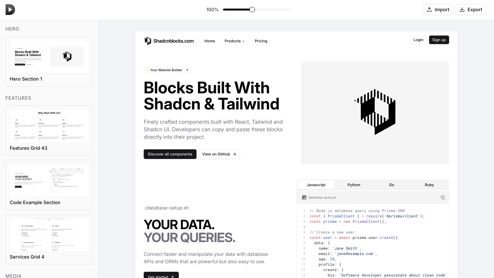

# DraftCN





**A visual website builder** — drag-and-drop blocks onto a canvas, arrange with grid snapping and zoom/pan, then export your layout as a JSON project or a full React (Vite) codebase.


Built as a **client-side single-page application** with no backend: state lives in the browser, and the codebase demonstrates **React 19**, **Next.js 15**, **TypeScript**, **Zustand**, and a **documented architecture** with unit and integration tests.


---


## Contributors


James Jiang


---


## Overview


DraftCN is a **minimalist web design platform** for composing page layouts from pre-built block templates (heroes, navbars, features, pricing, FAQs, etc.). Users drag blocks from a categorized library onto a fixed-width canvas, reposition them with optional grid snapping, zoom and pan for navigation, and export either:


- **Project JSON** — save/load layouts (import with validation)
- **React project (ZIP)** — runnable Vite + TypeScript app with resolved dependencies and generated component files


The project emphasizes **clear data models** (Block, BlockTemplate, registry), **sliced state** (blocks, drag, UI/zoom/pan), **coordinate transforms** for a virtual camera, and **tested workflows** (export/import cycle, React export, canvas behavior).


---


## Features


### User-facing


- **Block library** — Sidebar with search and categories; drag templates onto the canvas
- **Freeform canvas** — 1200px-wide workspace with auto-expanding height; blocks are absolutely positioned
- **Grid system** — 40px grid overlay, snap-to-grid on drop/move, **Alt** to bypass for pixel-precise placement
- **Virtual camera** — Zoom (slider) and pan; all interactions use world ↔ screen coordinate transforms
- **Selection & keyboard** — Click to select, Delete/Backspace to remove; selection state synced across store and block instances
- **Export** — Download project as timestamped JSON
- **Import** — Load JSON with schema validation and error reporting
- **Export to React** — Generate a Vite + React + TypeScript ZIP: components, `globals.css`, dependency resolution, and README


### Technical highlights


- **Template system** — BlockRegistry with lazy-loaded React components; templates define `typeId`, default props, dimensions, and optional source for code export
- **State** — Zustand store with slices: blocks (CRUD, selection), drag (source, position, offset), UI (zoom, pan, search blur callback)
- **Drag lifecycle** — Drag-from-library vs drag-from-canvas; drop handling and snapping live in the canvas; drag state in store
- **Cross-component UX** — Search focus clears canvas selection; block selection triggers search blur (callback registration via UI slice) to avoid focus/backspace conflicts
- **Export pipeline** — Template source map, dependency resolution from imports, and static file generation for the React ZIP


---


## Tech stack


| Area | Choice |
|------|--------|
| Language | TypeScript 5.x |
| Framework | Next.js 15 (App Router), React 19 |
| State | Zustand 4.x (sliced store) |
| UI | shadcn/ui (Radix), Tailwind CSS 4 |
| Build | Next.js (Turbopack in dev) |
| Tests | Vitest, React Testing Library, jsdom |
| Export | JSZip (React project ZIP), custom JSON (project save/load) |


---


## Project structure


```
├── app/                    # Next.js App Router (layout, page, globals.css)
├── components/
│   ├── canvas/             # Canvas, drop preview, coordinate-aware block rendering
│   ├── layout/             # Sidebar, header, zoom, export/import buttons
│   └── blocks/             # Block library, template cards, error boundary
├── store/                  # Zustand store and slices (blocks, drag, ui)
├── lib/
│   ├── blocks/             # Registry, template registration, template-sources for export
│   ├── canvas/             # Zoom/pan transforms (world ↔ screen)
│   ├── project/            # export, import (validation), react-export (ZIP), dependency-resolver
│   └── drag/               # Drag manager (lifecycle, no DOM)
├── hooks/                  # useKeyboard, useDrag
├── templates/              # React block components (hero, navbar, pricing, etc.)
├── types/                  # Block, BlockTemplate, store-related types
├── tests/
│   ├── unit/               # Components, store slices, lib, hooks
│   └── integration/       # Export/import cycle, React export
└── docs/                   # Architecture, PRD, QA gates, user stories
```


---


## Getting started


**Requirements:** Node 20+, npm 10+


```bash
git clone https://github.com/<your-org>/DraftCN.git
cd DraftCN
npm install
npm run dev
```


Open [http://localhost:3000](http://localhost:3000). Use the sidebar to drag blocks onto the canvas, zoom/pan, and try Export (JSON) or Export to React (ZIP).


**Scripts:**


- `npm run dev` — Dev server (Turbopack)
- `npm run build` — Production build
- `npm run start` — Run production build
- `npm run test` — Vitest (watch)
- `npm run test:run` — Single test run
- `npm run test:coverage` — Coverage report
- `npm run lint` — ESLint


---


## Testing


Tests are in `tests/unit/` and `tests/integration/`:


- **Store** — Blocks slice (add/update/remove/selection), drag slice, UI slice
- **Lib** — Canvas transforms, block registry, project export/import, react-export, dependency resolver, static sources
- **Components** — Canvas (selection, zoom, drag, drop preview), BlockLibrary, layout (header, zoom, export/import), TemplateCard, error boundary
- **Hooks** — useKeyboard, useDrag
- **Integration** — Export/import round-trip, React export output


Run: `npm run test:run` or `npm run test:coverage`.


---


## Documentation


- **Architecture** — `docs/architecture/` (tech stack, data models, components, core workflows, testing strategy, error handling, security/performance)
- **Product** — `docs/prd/` (goals, requirements, epics, UI design goals, technical assumptions)
- **QA** — `docs/qa/gates/` (acceptance criteria for features)
- **Adding blocks** — `docs/adding-block-templates.md`


---


## License


Private / unlicensed unless otherwise specified.


---


*DraftCN — simplest web design platform for everyday use.*
