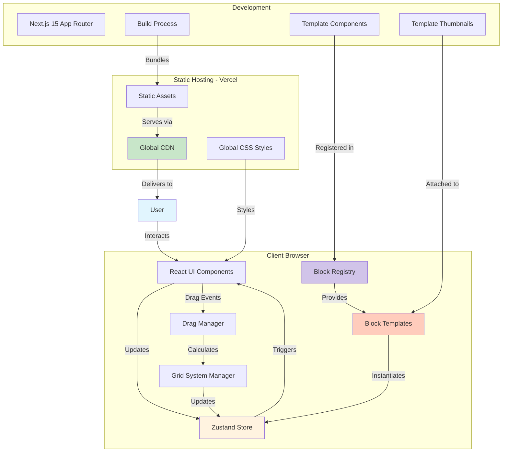
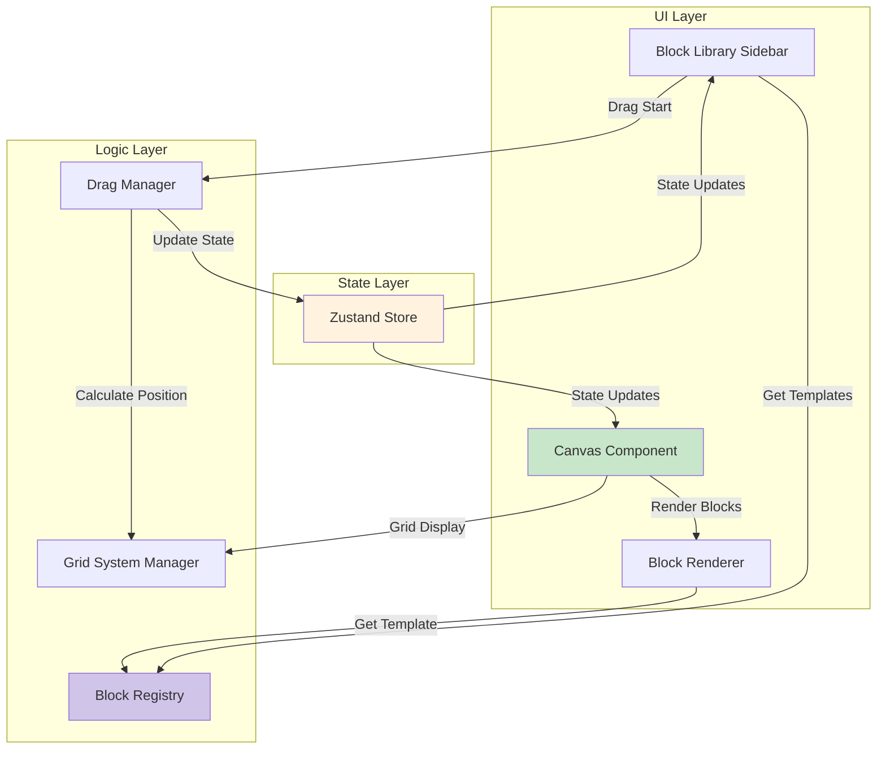
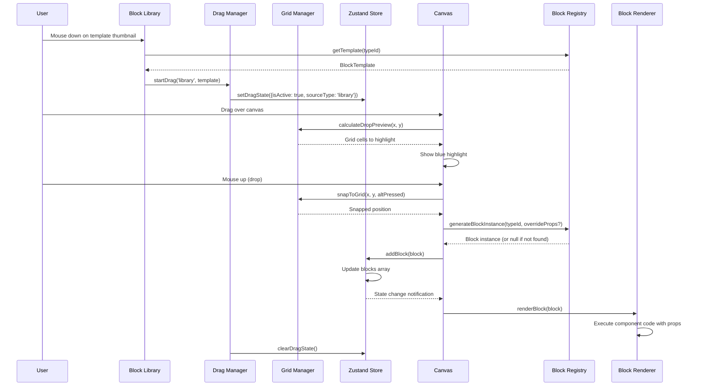
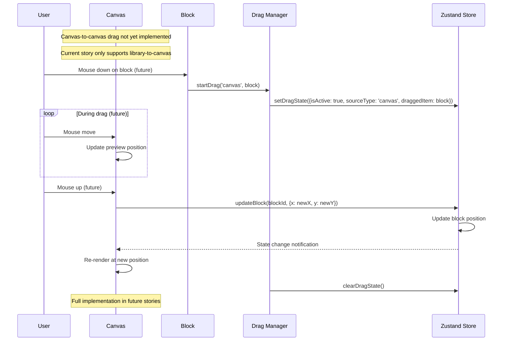
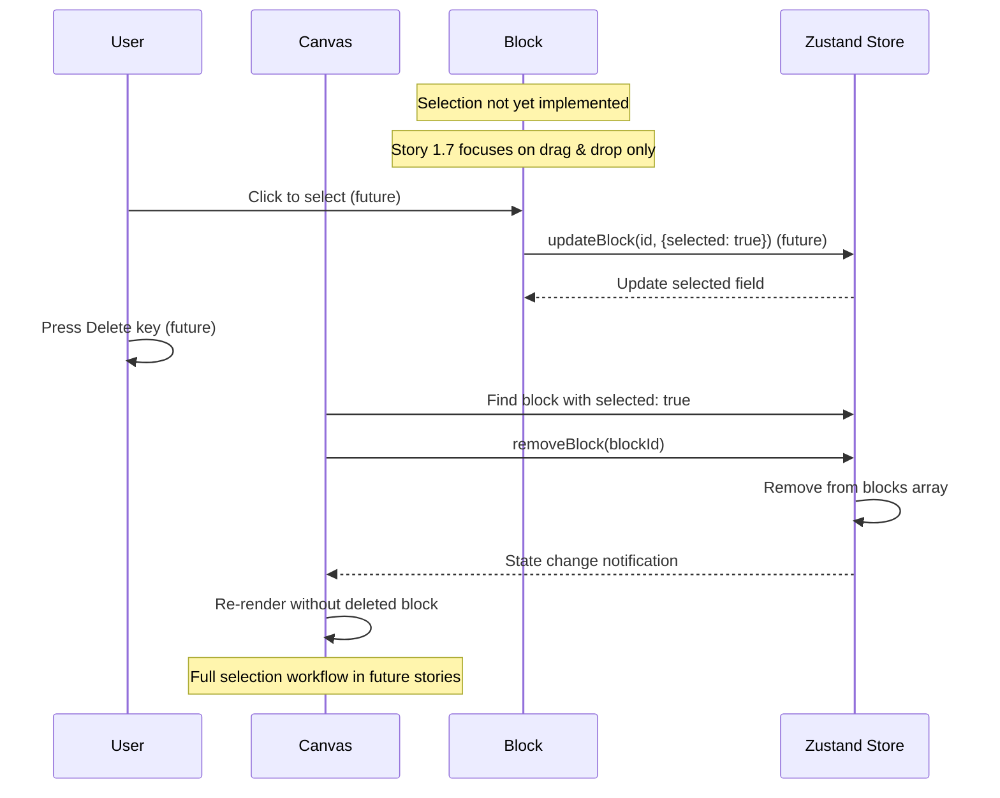
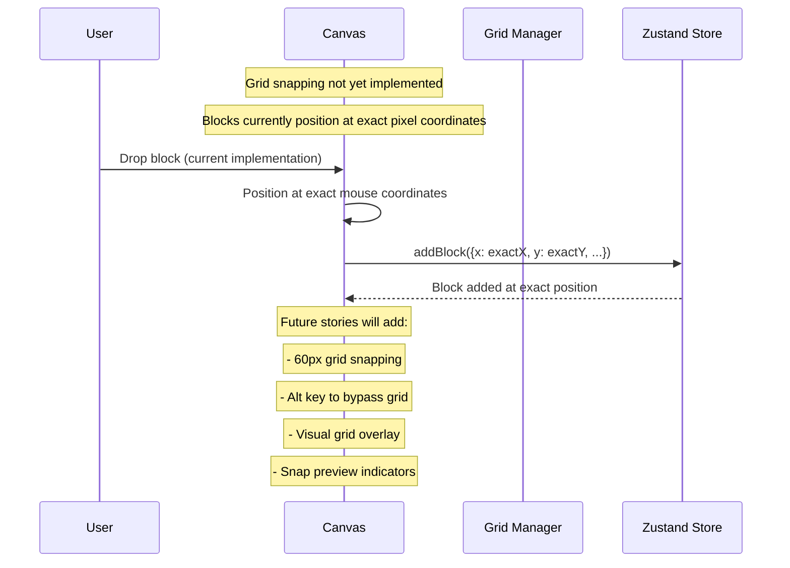
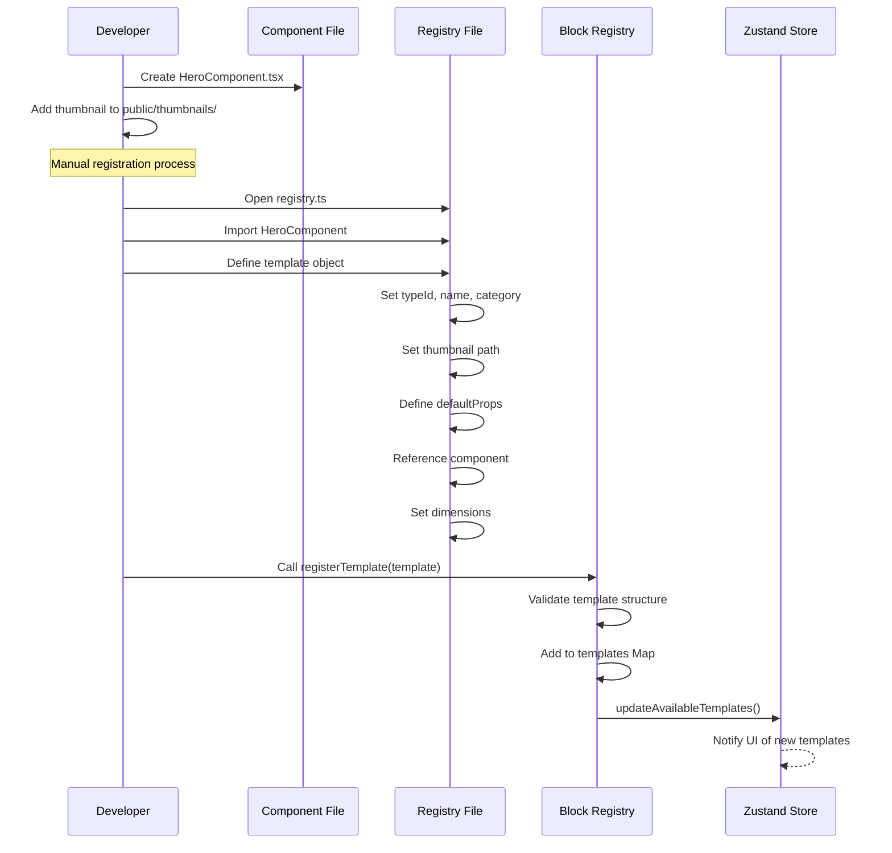
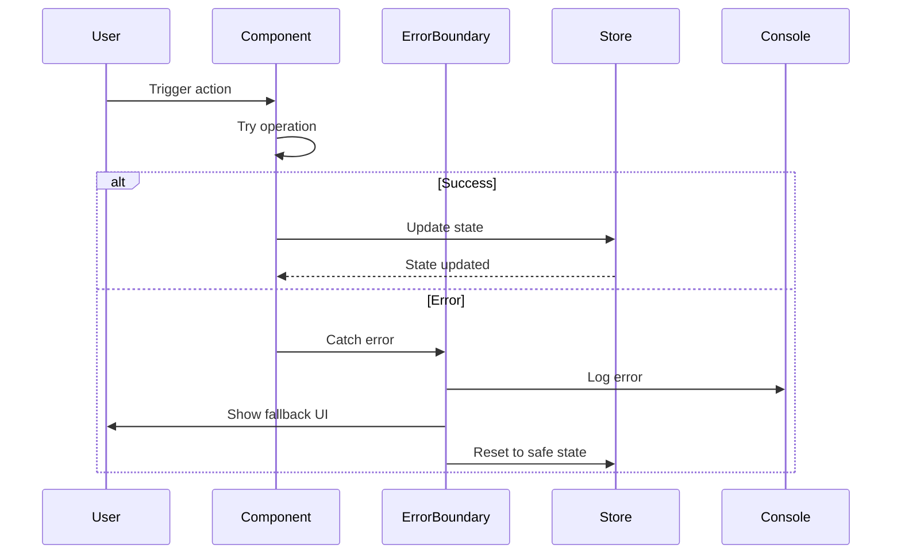

# DraftCN Fullstack Architecture Document

## Introduction

### DraftCN Fullstack Architecture Document

This document outlines the complete fullstack architecture for **DraftCN**, including backend systems, frontend implementation, and their integration. It serves as the single source of truth for AI-driven development, ensuring consistency across the entire technology stack.

This unified approach combines what would traditionally be separate backend and frontend architecture documents, streamlining the development process for modern fullstack applications where these concerns are increasingly intertwined.

#### Technical Context

The architecture supports a unique **template-based block system** where:
- Block templates are manually defined and registered in a central registry
- Each template includes metadata, props interfaces, and React component definitions
- Instances are created from templates with customized props
- A global CSS file provides consistent styling across all blocks
- Templates are added to the registry by developers as needed

This approach enables:
- **Developer-friendly template creation** - Write standard React components
- **Reusable block definitions** - One template, many instances
- **Props-based customization** - Change content without modifying code
- **Future extensibility** - Path to inline editing and persistence

#### Starter Template or Existing Project

**N/A - Greenfield project**

No starter templates or existing projects are mentioned in the PRD or front-end spec. This is a completely new implementation built from scratch with specific technology choices outlined for the MVP.

#### Change Log

| Date       | Version | Description                    | Author           |
| ---------- | ------- | ------------------------------ | ---------------- |
| 2025-01-06 | v1.0    | Initial architecture document  | Winston (Architect) |
| 2025-01-13 | v1.1    | Updated to match implementation reality | Winston (Architect) |
| 2025-01-14 | v1.2    | Corrected Zustand state management to match actual implementation | Winston (Architect) |

## High Level Architecture

### Technical Summary

DraftCN is a client-side visual website builder utilizing Next.js 15's App Router with React 19 for optimal performance. The architecture employs a grid-based drag-and-drop system with freeform block positioning, managed through Zustand for predictable state management. The frontend leverages shadcn/ui components for consistent UI elements, while the 60px grid system ensures professional layouts. With no backend services, the application runs entirely in the browser, deploying as a static site to Vercel for global edge distribution. This architecture achieves the PRD goals by providing immediate visual feedback, intuitive grid-based placement, and a foundation for future enhancements while maintaining 60fps performance during drag operations.

### Platform and Infrastructure Choice

**Platform:** Vercel  
**Key Services:** Edge Network, Static Site Hosting, Analytics (optional)  
**Deployment Host and Regions:** Global Edge Network (automatic)

### Repository Structure

**Structure:** Monorepo  
**Monorepo Tool:** npm workspaces (built-in, simple for single app)  
**Package Organization:** Single Next.js app with potential for shared packages in future

### High Level Architecture Diagram



### Architectural Patterns

- **Component-Based Architecture:** Modular React components with shadcn/ui for reusability - *Rationale:* Enables rapid UI development and consistent design system
- **Template-Instance Pattern:** Separation of block templates (definitions) from block instances (positioned elements) - *Rationale:* Allows reuse of templates with different content/props
- **Client-Side State Management:** Zustand store for all application state including blocks and templates - *Rationale:* Lightweight, performant, and simple compared to Redux
- **Grid-First Positioning:** 60px grid system as primary layout constraint - *Rationale:* Provides predictable, professional layouts while simplifying position calculations
- **Props-Based Customization:** Block content customized via props without modifying template code - *Rationale:* Enables future inline editing without template changes
- **Static Site Generation:** Pre-rendered HTML with client-side hydration - *Rationale:* Fastest initial load times
- **Template Registry Pattern:** Centralized management of available block templates - *Rationale:* Simplifies template discovery and instantiation
- **Event-Driven Updates:** Mouse/keyboard events trigger state changes - *Rationale:* Direct manipulation requires immediate event handling
- **Render Optimization:** React.memo and selective re-renders - *Rationale:* Maintains 60fps during rapid drag operations

## Tech Stack

This is the **DEFINITIVE** technology selection for the entire project. All development must use these exact versions.

### Technology Stack Table

| Category | Technology | Version | Purpose | Rationale |
|----------|------------|---------|---------|-----------|
| Frontend Language | TypeScript | 5.3+ | Type-safe development | Prevents runtime errors, improves IDE support, essential for complex drag-drop logic |
| Frontend Framework | Next.js | 15.0+ | React framework with App Router | Latest performance optimizations, React 19 support, excellent Vercel integration |
| UI Component Library | shadcn/ui | Latest | Accessible, customizable components | Copy-paste model allows customization, well-tested patterns, Tailwind integration |
| State Management | Zustand | 4.5+ | Client-side state management | Lightweight (8kb), simple API, perfect for drag-drop state, excellent TypeScript support |
| Backend Language | N/A | - | No backend for MVP | Client-side only per requirements |
| Backend Framework | N/A | - | No backend for MVP | Future: Next.js API routes |
| API Style | N/A | - | No API for MVP | Future: REST or tRPC |
| Database | N/A | - | No persistence for MVP | All state in memory only |
| Cache | Browser Memory | - | Runtime state caching | Zustand manages in-memory state |
| File Storage | N/A | - | No file storage needed | Blocks stored in memory only |
| Authentication | N/A | - | No auth for MVP | Public access only |
| Frontend Testing | Vitest | 1.0+ | Unit testing | Fast, Jest-compatible, works well with Vite |
| Backend Testing | N/A | - | No backend to test | Future: Vitest for API routes |
| E2E Testing | Playwright | 1.40+ | Integration testing (post-MVP) | Modern, fast, good debugging tools |
| Build Tool | Next.js Turbopack | Built-in | Development builds | Faster than Webpack, built into Next.js 15 |
| Bundler | Next.js/Webpack | Built-in | Production builds | Automatic optimization |
| IaC Tool | N/A | - | No infrastructure needed | Vercel handles everything |
| CI/CD | GitHub Actions | Latest | Automated testing/deployment | Free for public repos, Vercel integration |
| Monitoring | Vercel Analytics | Latest | Basic metrics (optional) | Built-in, zero-config |
| Logging | Console | Browser | Development debugging | No server logs needed |
| CSS Framework | Tailwind CSS | 3.4+ | Utility-first styling | Required by shadcn/ui, fast development |
| Runtime | React | 19.0+ | UI library | Latest concurrent features, improved performance |
| Package Manager | npm | 10.0+ | Dependency management | Built-in workspaces support |
| Linting | ESLint | 8.50+ | Code quality | Next.js preset included |
| Formatting | Prettier | 3.0+ | Code formatting | Consistent code style |
| Template Management | JavaScript Objects | Built-in | Template registry system | Manual registration of block templates |
| Component Runtime | React.lazy | 19.0+ | Dynamic component loading | Load block templates on demand |
| Style Management | Global CSS | - | Shared block styles | Centralized styling in globals.css |
| Asset Management | Base64/URLs | - | Template thumbnails | Simple image handling for previews |

## Data Models

### Block

**Purpose:** Represents an individual draggable UI component instance on the canvas with complete positioning, rendering information, and customized content.

**Key Attributes:**
- `id: string` - Unique identifier for every block instance
- `typeId: string` - References the block template type (e.g., "hero-1")
- `props: any` - Customized content following template's props interface
- `x: number` - Horizontal position in pixels
- `y: number` - Vertical position in pixels
- `width: number` - Block width in pixels
- `height: number` - Block height in pixels
- `z: number` - Stacking order (1 = first block added)
- `selected: boolean` - Whether the block is currently selected

#### TypeScript Interface
```typescript
interface Block {
  id: string;
  typeId: string;
  props: any; // Matches template's specific props interface
  x: number;
  y: number;
  width: number;
  height: number;
  z: number;
  selected: boolean;
}
```

#### Relationships
- References a BlockTemplate via typeId
- Props must conform to template's interface structure
- Z-index determines visual stacking when blocks overlap

#### Selection Architecture Note
The `selected` field in Block is initialized as `false` when blocks are created. In the current implementation:
- Selection is tracked via the boolean `selected` field in each Block object
- No separate SelectionSlice exists yet (planned for future stories)
- Selection operations will be handled by updating the block's `selected` field via `updateBlock`
- Multi-select and advanced selection features are not yet implemented

### BlockTemplate

**Purpose:** Defines reusable block blueprints with their dependencies, default props, and rendering code.

**Key Attributes:**
- `typeId: string` - Unique template identifier (e.g., "hero-1")
- `name: string` - Display name for the template
- `category: string` - Template category for grouping
- `thumbnail: string` - Base64 or URL for preview image
- `dependencies: string[]` - Required npm packages/imports extracted from imports
- `defaultProps: any` - Example content for initial rendering
- `component: React.ComponentType<any>` - The React component for rendering
- `defaultWidth: number` - Initial width in pixels
- `defaultHeight: number` - Initial height in pixels
- `minimumWidth: number` - Minimum allowed width for resizing
- `minimumHeight: number` - Minimum allowed height for resizing

#### TypeScript Interface
```typescript
interface BlockTemplate {
  typeId: string;
  name: string;
  category: string;
  thumbnail: string;
  dependencies: string[];
  defaultProps: any;
  component: React.ComponentType<any>;
  defaultWidth: number;
  defaultHeight: number;
  minimumWidth: number;
  minimumHeight: number;
}
```

#### Relationships
- Templates are instantiated to create Block instances
- Global CSS file assumed to contain all required styles
- Dependencies list extracted from import statements

### BlockRegistry

**Purpose:** Manages the collection of available block templates and provides template instantiation utilities.

#### TypeScript Interface
```typescript
interface BlockRegistry {
  templates: Map<string, BlockTemplate>;
  categories: string[];
  
  // Methods for template management
  registerTemplate(template: BlockTemplate): void;
  getTemplate(typeId: string): BlockTemplate | undefined;
  getTemplatesByCategory(category: string): BlockTemplate[];
  generateBlockInstance(typeId: string, props?: any): Block;
}
```

### Template Registration

**Purpose:** Manual registration of block templates in the central registry.

#### Registration Structure
```typescript
// Example of manually registering a template
const heroTemplate: BlockTemplate = {
  typeId: 'hero-1',
  name: 'Hero Section',
  category: 'Heroes',
  thumbnail: '/thumbnails/hero-1.png',
  dependencies: ['@/components/ui/button'],
  defaultProps: {
    title: 'Welcome to Our Site',
    subtitle: 'Build amazing websites visually',
    buttonText: 'Get Started'
  },
  component: HeroComponent,
  defaultWidth: 1200,
  defaultHeight: 400,
  minimumWidth: 600,
  minimumHeight: 200
};

// Register the template
registry.registerTemplate(heroTemplate);
```

### Methods for Block Template Development

#### 1. Manual Template Registration
```typescript
// Step 1: Create your React component
import { Button } from '@/components/ui/button';

const HeroComponent = ({ title, subtitle, buttonText }) => {
  return (
    <div className="hero-section">
      <h1>{title}</h1>
      <p>{subtitle}</p>
      <Button>{buttonText}</Button>
    </div>
  );
};

// Step 2: Register the template in the registry
const heroTemplate: BlockTemplate = {
  typeId: 'hero-1',
  name: 'Hero Section',
  category: 'Heroes',
  thumbnail: '/thumbnails/hero-1.png',
  dependencies: ['@/components/ui/button'],
  defaultProps: {
    title: 'Welcome',
    subtitle: 'Build amazing websites',
    buttonText: 'Get Started'
  },
  component: HeroComponent,
  defaultWidth: 1200,
  defaultHeight: 400,
  minimumWidth: 600,
  minimumHeight: 200
};

// Step 3: Add to registry
blockRegistry.registerTemplate(heroTemplate);
```

#### 2. Block Instance Creation
```typescript
function createBlockInstance(
  typeId: string,
  position: { x: number; y: number },
  customProps?: any
): Block {
  const template = blockRegistry.getTemplate(typeId);
  if (!template) throw new Error(`Template ${typeId} not found`);
  
  const props = customProps || template.defaultProps;
  
  return {
    id: `${typeId}-${Date.now()}-${Math.random().toString(36).substring(2, 11)}`,
    typeId,
    props,
    x: snapToGrid(position.x),
    y: snapToGrid(position.y),
    width: template.defaultWidth,
    height: template.defaultHeight,
    z: getNextZIndex()
  };
}
```

#### 3. Adding New Templates - Step by Step

**Step 1: Create Your Component**
Create a new React component file in `src/templates/` folder:

```typescript
// src/templates/navbar/NavbarComponent.tsx
import { Button } from '@/components/ui/button';

interface NavbarProps {
  logo: string;
  links: Array<{ label: string; href: string; }>;
}

const NavbarComponent = ({ logo, links }: NavbarProps) => {
  return (
    <nav className="navbar">
      <div className="logo">{logo}</div>
      <ul className="nav-links">
        {links.map(link => (
          <li key={link.href}>
            <a href={link.href}>{link.label}</a>
          </li>
        ))}
      </ul>
    </nav>
  );
};

export { NavbarComponent };
```

**Step 2: Add Template to Registry**
In `src/lib/blocks/registry.ts`, add your template:

```typescript
import { NavbarComponent } from '@/templates/navbar/NavbarComponent';

const navbarTemplate: BlockTemplate = {
  typeId: 'navbar-1',
  name: 'Navigation Bar',
  category: 'Navigation',
  thumbnail: '/thumbnails/navbar-1.png',
  dependencies: ['@/components/ui/button'],
  defaultProps: {
    logo: 'MyApp',
    links: [
      { label: 'Home', href: '/' },
      { label: 'About', href: '/about' },
      { label: 'Contact', href: '/contact' }
    ]
  },
  component: NavbarComponent,
  defaultWidth: 1200,
  defaultHeight: 80,
  minimumWidth: 800,
  minimumHeight: 60
};

// Register the template
registry.registerTemplate(navbarTemplate);
```

**Step 3: Add Thumbnail**
Place a preview image at `public/thumbnails/navbar-1.png`

**Step 4: Add Styles (if needed)**
Add any required styles to `app/globals.css`:

```css
.navbar {
  display: flex;
  justify-content: space-between;
  padding: 1rem 2rem;
  background: white;
  border-bottom: 1px solid #e5e5e5;
}
```

### Canvas and Store State Types

```typescript
// Canvas State Type (from types/canvas.ts)
export interface CanvasState {
  blocks: Block[];
  selectedBlockIds: string[];
  canvasWidth: number;
  canvasHeight: number;
  zoom: number;
  panX: number;
  panY: number;
}

// Note: The actual implementation currently manages canvas state differently:
// - Blocks are stored in BlocksSlice
// - Selection is tracked via Block.selected field (selectedBlockIds not yet implemented)
// - Canvas dimensions, zoom, and pan are not yet implemented
// - Drag state is managed in DragSlice
```

## API Specification

Since this is a **client-side only MVP with no backend**, there is no traditional API. However, we'll define the key interfaces for future backend integration.

**N/A for MVP** - All operations are client-side only with no persistence.

### Future API Considerations

When we add a backend in post-MVP phases, the API will likely include:

- **Block Template Management** - CRUD operations for templates
- **Project Persistence** - Save/load canvas states
- **Asset Management** - Upload and serve template thumbnails
- **User Management** - Authentication and authorization

For now, all state management happens through Zustand store operations without network calls.

## Components

Based on the architectural patterns, tech stack, and data models, here are the major logical components across the fullstack application.

### Canvas Component

**Responsibility:** Manages the main workspace where blocks are positioned and rendered. Handles grid overlay, drop zones, and block rendering.

**Key Interfaces:**
- `onBlockDrop(block: Block)` - Handle new block placement
- `onBlockMove(blockId: string, position: {x, y})` - Handle block repositioning
- `onBlockSelect(blockId: string)` - Handle block selection
- `renderGrid()` - Display 60px grid overlay

**Dependencies:** Grid System Manager, Block Renderer, Dead Zone Component

**Technology Stack:** React 19, Tailwind CSS for grid styling, Zustand for state

### Block Library Sidebar

**Responsibility:** Displays available block templates organized by category, enables drag initiation from template thumbnails.

**Key Interfaces:**
- `getTemplatesByCategory(category: string)` - Filter templates
- `onDragStart(typeId: string)` - Initiate template drag
- `renderThumbnail(template: BlockTemplate)` - Display template preview

**Dependencies:** Block Registry, Drag Manager

**Technology Stack:** React 19, shadcn/ui ScrollArea, Zustand for template state

### Block Renderer

**Responsibility:** Dynamically renders block instances with their customized props, handles component code execution and styling.

**Key Interfaces:**
- `renderBlock(block: Block, template: BlockTemplate)` - Render single block
- `applyProps(component: React.ComponentType, props: any)` - Render component with props
- `handleSelection(blockId: string)` - Apply selection styling

**Dependencies:** Block Registry for templates, Global CSS for styling

**Technology Stack:** React 19 with dynamic component loading, React.lazy for code splitting

### Drag Manager

**Responsibility:** Coordinates all drag-and-drop operations including library-to-canvas and canvas-to-canvas movements.

**Implementation:** Managed via DragSlice in the Zustand store

**Key Interfaces:**
- `setDragState(state: Partial<DragState>)` - Update any part of drag state
- `updateDragPosition(x: number, y: number)` - Update cursor position during drag
- `clearDragState()` - Reset to initial state after drag ends

**State Properties (from DragSlice):**
- `isActive: boolean` - Whether a drag is in progress
- `sourceType: 'library' | 'canvas' | null` - Where the drag originated
- `draggedItem: any` - The template or block being dragged
- `position: { x: number; y: number }` - Current mouse position
- `offset: { x: number; y: number }` - Click offset within dragged item

**Dependencies:** Grid System Manager for snapping, Canvas State for boundaries

**Technology Stack:** React 19 event handlers, Zustand for drag state

### Grid System Manager

**Responsibility:** Handles all grid-related calculations including snapping, grid rendering, and Alt-key bypass logic.

**Key Interfaces:**
- `snapToGrid(x: number, y: number, bypass: boolean)` - Calculate snapped position
- `getGridCells(x: number, y: number, width: number, height: number)` - Get occupied cells
- `renderGridOverlay()` - Generate grid visual
- `calculateDropPreview(x: number, y: number)` - Show drop zone

**Dependencies:** Canvas State for grid size configuration

**Technology Stack:** Pure TypeScript calculations, CSS for grid visualization


### Block Registry

**Responsibility:** Central repository for all available block templates, manages template lifecycle and instance creation.

**Key Interfaces:**
- `registerTemplate(template: BlockTemplate)` - Add new template
- `getTemplate(typeId: string)` - Retrieve specific template
- `generateBlockInstance(typeId: string, overrideProps?: any)` - Generate block instance with merged props (returns null if template not found)
- `getCategories()` - List all template categories
- `getAllTemplates()` - Returns all registered templates
- `getTemplatesByCategory(category: string)` - Filter templates by category

**Dependencies:** Local storage for caching (future)

**Technology Stack:** TypeScript Map for storage, Singleton pattern

### State Manager (Zustand Store)

**Responsibility:** Centralized state management for blocks and drag operations.

**Store Structure:**
- `store/index.ts` - Main store combining all slices
- `store/slices/blocks.ts` - Block management slice with selectors
- `store/slices/drag.ts` - Drag operation slice with selectors

**Key Interfaces:**
- `addBlock(block: Block)` - Add new block to canvas
- `updateBlock(id: string, updates: Partial<Block>)` - Modify block properties
- `removeBlock(id: string)` - Remove block from canvas
- `clearBlocks()` - Remove all blocks
- `setDragState(state: Partial<DragState>)` - Update drag state
- `clearDragState()` - Reset drag to initial state

**Dependencies:** None - top of state hierarchy

**Technology Stack:** Zustand 4.5+, TypeScript with StateCreator pattern

### Component Diagrams



## External APIs

### No External APIs Required for MVP

Since this is a client-side only application with no backend or persistence, there are no external API integrations needed for the MVP.

All block templates are bundled with the application, thumbnails are included as static assets, and no data is saved or retrieved from external sources. The application runs entirely in the browser without network dependencies after initial load.

## Core Workflows

### Add Block from Library to Canvas



### Reposition Existing Block (Future Story)



### Delete Selected Block (Future Story)



### Grid System (Future Story)



### Template Registration (Development Flow)



## Database Schema

### No Database for MVP

Since this is a client-side only application with no persistence, there is no database schema required for the MVP. All data exists in memory through the Zustand store and is lost on page refresh.

### Future Database Considerations

When persistence is added post-MVP, the schema would likely include:

```sql
-- Future schema structure (not implemented in MVP)
-- Projects table for saved canvases
-- Blocks table for persisted block instances  
-- Templates table for custom user templates
-- Assets table for uploaded images
```

For now, all state is managed in-memory with the data models defined earlier.

## Frontend Architecture

### Component Architecture

#### Component Organization

```text
src/
├── components/
│   ├── ui/                    # shadcn/ui components
│   │   ├── button.tsx
│   │   ├── badge.tsx
│   │   └── scroll-area.tsx
│   ├── canvas/
│   │   ├── Canvas.tsx         # Main canvas component
│   │   ├── Grid.tsx           # Grid overlay
│   │   ├── DeadZones.tsx      # Boundary indicators
│   │   └── DropPreview.tsx    # Drag preview
│   ├── blocks/
│   │   ├── BlockRenderer.tsx  # Dynamic block rendering
│   │   ├── BlockWrapper.tsx   # Selection/positioning wrapper
│   │   └── (No BlockInstance - Canvas renders blocks directly)
│   ├── sidebar/
│   │   ├── BlockLibrary.tsx   # Template library sidebar
│   │   ├── TemplateCard.tsx   # Template thumbnail card
│   │   └── CategoryFilter.tsx # Category organization
│   └── layout/
│       ├── Header.tsx          # App header with logo
│       └── Layout.tsx          # Main layout wrapper
```

#### Component Template

```typescript
// Example component structure with actual store usage
import { useCallback } from 'react';
import { useAppStore } from '@/store';
import { dragSelectors } from '@/store/slices/drag';
import { blocksSelectors } from '@/store/slices/blocks';

// Canvas Direct Rendering Pattern
// The Canvas component renders blocks directly without a BlockInstance wrapper:
export const Canvas: React.FC = () => {
  // Access store using selectors for optimal performance
  const blocks = useAppStore(blocksSelectors.getAllBlocks);
  const isDragging = useAppStore(dragSelectors.isDragging);

  return (
    <div className="relative w-full h-full bg-slate-50 overflow-auto">
      {/* Render each block directly */}
      {blocks.map((block) => {
        const template = blockRegistry.getTemplate(block.typeId);
        if (!template) return null;

        const Component = template.component;
        if (!Component) return null;

        return (
          <div
            key={block.id}
            className="absolute border border-gray-300 rounded"
            style={{
              left: block.x,
              top: block.y,
              width: block.width,
              height: block.height,
              zIndex: block.z,
            }}
            data-block-id={block.id}
            data-testid={`block-${block.id}`}
          >
            <Component {...block.props} />
          </div>
        );
      })}

      {/* Drag indicator overlay */}
      {isDragging && (
        <div className="absolute inset-0 pointer-events-none">
          <div className="w-full h-full border-2 border-dashed border-primary/20" />
        </div>
      )}
    </div>
  );
};
```

### State Management Architecture

#### State Structure

```typescript
// Actual Zustand store structure - simplified slices pattern
export type AppStore = AppState & AppActions & DragSlice & BlocksSlice;

// AppState - global app state
export interface AppState {
  initialized: boolean;
}

export interface AppActions {
  setInitialized: (initialized: boolean) => void;
}

// BlocksSlice - manages all block operations
export interface BlocksSlice {
  // State
  blocks: Block[];

  // Actions
  addBlock: (block: Block) => void;
  updateBlock: (id: string, updates: Partial<Block>) => void;
  removeBlock: (id: string) => void;
  clearBlocks: () => void;
  getHighestZIndex: () => number;
}

// DragSlice - manages drag and drop operations
export interface DragSlice extends DragState, DragActions {}

export interface DragState {
  isActive: boolean;
  sourceType: 'library' | 'canvas' | null;
  draggedItem: any; // The template or block being dragged
  position: {
    x: number;
    y: number;
  };
  offset: {
    x: number;
    y: number;
  };
}

export interface DragActions {
  setDragState: (state: Partial<DragState>) => void;
  updateDragPosition: (x: number, y: number) => void;
  clearDragState: () => void;
}

// Note: Selection is currently handled via the 'selected' boolean field in each Block.
// No separate SelectionSlice exists in the current implementation.
// Future stories may introduce more sophisticated selection management.
```

#### State Management Patterns

- **Slice Pattern** - Store split into logical slices using StateCreator
- **Selector Functions** - Helper selectors exported from each slice for common queries
- **Atomic Updates** - Each action updates minimal state
- **Direct State Access** - Components use `useAppStore` with selectors
- **No Async Actions** - All state updates are synchronous (no backend)

### Routing Architecture

#### Route Organization

```text
app/
├── page.tsx                    # Main builder page (only route)
├── layout.tsx                  # Root layout with providers
└── globals.css                 # Global styles for blocks
```

Since this is a single-page application, there's only one route - the main builder interface.

#### Protected Route Pattern

```typescript
// Not needed for MVP - no authentication
// Future implementation would wrap builder in auth check
```

### Frontend Services Layer

#### Block Registry Service

```typescript
// The BlockRegistry manages all templates (lib/blocks/registry.ts)
export class BlockRegistry {
  private templates: Map<string, BlockTemplate> = new Map();

  registerTemplate(template: BlockTemplate): void {
    this.templates.set(template.typeId, template);
  }

  getTemplate(typeId: string): BlockTemplate | undefined {
    return this.templates.get(typeId);
  }

  generateBlockInstance(typeId: string, overrideProps?: any): Block | null {
    const template = this.getTemplate(typeId);
    if (!template) return null;

    return {
      id: `${typeId}-${Date.now()}-${Math.random().toString(36).substring(2, 11)}`,
      typeId: template.typeId,
      props: { ...template.defaultProps, ...overrideProps },
      x: 0,
      y: 0,
      width: template.defaultWidth,
      height: template.defaultHeight,
      z: 0,
      selected: false,
    };
  }

  getAllTemplates(): BlockTemplate[] {
    return Array.from(this.templates.values());
  }

  getCategories(): string[] {
    const categories = new Set<string>();
    this.templates.forEach((template) => categories.add(template.category));
    return Array.from(categories);
  }
}

// Singleton instance
export const blockRegistry = new BlockRegistry();
```

## Backend Architecture

### No Backend for MVP

This is a **client-side only application** with no backend architecture for the MVP phase. All logic runs in the browser, and there is no server-side processing, database, or API endpoints.

### Future Backend Considerations

When a backend is added post-MVP, it would likely use:

- **Next.js API Routes** - Serverless functions within the same codebase
- **Database** - PostgreSQL or MongoDB for persistence
- **Authentication** - NextAuth.js or Clerk for user management
- **File Storage** - S3 or Vercel Blob for template assets

For now, the application operates entirely client-side with no backend dependencies.

## Unified Project Structure

```plaintext
draftcn/
├── .github/                    # CI/CD workflows
│   └── workflows/
│       └── deploy.yaml         # Vercel deployment
├── app/                        # Next.js App Router
│   ├── page.tsx               # Main builder page
│   ├── layout.tsx             # Root layout with providers
│   └── globals.css            # Global styles for blocks
├── components/                 # React components
│   ├── ui/                    # shadcn/ui components
│   │   ├── button.tsx
│   │   ├── badge.tsx
│   │   ├── scroll-area.tsx
│   │   └── ...
│   ├── canvas/                # Canvas components
│   │   ├── Canvas.tsx         # Main canvas with direct block rendering
│   │   └── DropPreview.tsx    # Drag preview overlay
│   ├── blocks/                # Block-related components
│   │   └── BlockLibrary.tsx   # Template library sidebar
│   └── layout/               # Layout components
│       ├── Header.tsx
│       └── Sidebar.tsx
├── lib/                       # Utilities and core logic
│   ├── blocks/               # Block management
│   │   ├── registry.ts      # Block registry
│   │   ├── processor.ts     # Template processor
│   │   └── types.ts         # Block type definitions
│   ├── drag/                # Drag-and-drop logic
│   │   ├── manager.ts       # Drag manager
│   │   └── utils.ts         # Drag utilities
│   ├── grid/                # Grid system
│   │   ├── calculator.ts    # Grid calculations
│   │   └── constants.ts     # Grid constants (60px)
│   └── utils.ts             # General utilities
├── store/                    # State management
│   ├── index.ts             # Main Zustand store combining slices
│   └── slices/              # Store slices with built-in selectors
│       ├── blocks.ts        # Blocks state and actions
│       └── drag.ts          # Drag state and actions
├── templates/               # Block template components
│   ├── hero1.tsx           # Hero section template
│   ├── navbar1.tsx         # Navigation bar template
│   ├── footer2.tsx         # Footer template
│   └── ...                 # Additional templates
├── types/                  # TypeScript definitions
│   ├── block.ts           # Block interfaces
│   ├── template.ts        # Template interfaces
│   └── canvas.ts          # Canvas interfaces
├── hooks/                  # Custom React hooks
│   ├── useDrag.ts         # Drag-and-drop hook
│   ├── useCanvas.ts       # Canvas operations hook
│   └── useKeyboard.ts     # Keyboard shortcuts hook
├── public/                 # Static assets
│   └── thumbnails/        # Template thumbnails
├── scripts/               # Build scripts
│   └── process-templates.js # Template preprocessing
├── tests/                 # Test files
│   ├── unit/             # Unit tests
│   └── integration/      # Integration tests
├── .env.example          # Environment template
├── .eslintrc.json       # ESLint configuration
├── .prettierrc          # Prettier configuration
├── next.config.js       # Next.js configuration
├── package.json         # Dependencies
├── tailwind.config.ts   # Tailwind configuration
├── tsconfig.json        # TypeScript configuration
└── README.md           # Project documentation
```

## Development Workflow

### Local Development Setup

#### Prerequisites

```bash
# Required software
node --version  # v20.0.0 or higher
npm --version   # v10.0.0 or higher
git --version   # Any recent version
```

#### Initial Setup

```bash
# Clone repository
git clone https://github.com/yourusername/draftcn.git
cd draftcn

# Install dependencies
npm install

# Copy environment variables (though none needed for MVP)
cp .env.example .env.local

# Install shadcn/ui components
npx shadcn@latest init
npx shadcn@latest add button badge scroll-area
```

#### Development Commands

```bash
# Start all services
npm run dev
# Runs Next.js dev server on http://localhost:3000

# Start frontend only (same as above for MVP)
npm run dev

# Start backend only (N/A for MVP)
# No backend in MVP

# Run tests
npm run test        # Run unit tests
npm run test:watch  # Watch mode
npm run test:e2e    # E2E tests (if configured)

# Linting and formatting
npm run lint        # ESLint check
npm run lint:fix    # Auto-fix issues
npm run format      # Prettier formatting

# Type checking
npm run type-check  # TypeScript validation

# Build for production
npm run build      # Create production build
npm run start      # Run production build locally
```

### Environment Configuration

#### Required Environment Variables

```bash
# Frontend (.env.local)
# No environment variables required for MVP
# All configuration is hardcoded

# Future variables might include:
# NEXT_PUBLIC_API_URL=http://localhost:3000/api
# NEXT_PUBLIC_STORAGE_URL=https://storage.example.com
```

## Deployment Architecture

### Deployment Strategy

**Frontend Deployment:**
- **Platform:** Vercel (automatic from GitHub)
- **Build Command:** `npm run build`
- **Output Directory:** `.next`
- **CDN/Edge:** Vercel Edge Network (automatic)

**Backend Deployment:**
- **Platform:** N/A - No backend for MVP
- **Build Command:** N/A
- **Deployment Method:** N/A

### CI/CD Pipeline

```yaml
# .github/workflows/deploy.yaml
name: Deploy to Vercel

on:
  push:
    branches: [main]
  pull_request:
    branches: [main]

env:
  VERCEL_ORG_ID: ${{ secrets.VERCEL_ORG_ID }}
  VERCEL_PROJECT_ID: ${{ secrets.VERCEL_PROJECT_ID }}

jobs:
  test:
    runs-on: ubuntu-latest
    steps:
      - uses: actions/checkout@v3
      
      - name: Setup Node.js
        uses: actions/setup-node@v3
        with:
          node-version: '20'
          cache: 'npm'
      
      - name: Install dependencies
        run: npm ci
      
      - name: Run type check
        run: npm run type-check
      
      - name: Run linter
        run: npm run lint
      
      - name: Run tests
        run: npm run test

  deploy-preview:
    runs-on: ubuntu-latest
    needs: test
    if: github.event_name == 'pull_request'
    steps:
      - uses: actions/checkout@v3
      
      - name: Install Vercel CLI
        run: npm install --global vercel@latest
      
      - name: Pull Vercel Environment
        run: vercel pull --yes --environment=preview --token=${{ secrets.VERCEL_TOKEN }}
      
      - name: Build Project
        run: vercel build --token=${{ secrets.VERCEL_TOKEN }}
      
      - name: Deploy to Vercel (Preview)
        run: vercel deploy --prebuilt --token=${{ secrets.VERCEL_TOKEN }}

  deploy-production:
    runs-on: ubuntu-latest
    needs: test
    if: github.event_name == 'push' && github.ref == 'refs/heads/main'
    steps:
      - uses: actions/checkout@v3
      
      - name: Install Vercel CLI
        run: npm install --global vercel@latest
      
      - name: Pull Vercel Environment
        run: vercel pull --yes --environment=production --token=${{ secrets.VERCEL_TOKEN }}
      
      - name: Build Project
        run: vercel build --prod --token=${{ secrets.VERCEL_TOKEN }}
      
      - name: Deploy to Vercel (Production)
        run: vercel deploy --prebuilt --prod --token=${{ secrets.VERCEL_TOKEN }}
```

### Environments

| Environment | Frontend URL | Backend URL | Purpose |
|------------|--------------|-------------|---------|
| Development | http://localhost:3000 | N/A | Local development |
| Preview | https://draftcn-[branch]-[org].vercel.app | N/A | PR preview deployments |
| Production | https://draftcn.vercel.app | N/A | Live environment |

## Security and Performance

### Security Requirements

**Frontend Security:**
- CSP Headers: `default-src 'self'; style-src 'self' 'unsafe-inline'; script-src 'self' 'unsafe-eval';` (for dynamic component rendering)
- XSS Prevention: React's built-in escaping, sanitize any user-provided HTML
- Secure Storage: No sensitive data stored (no auth in MVP)

**Backend Security:**
- Input Validation: N/A - No backend
- Rate Limiting: N/A - No API
- CORS Policy: N/A - No API

**Authentication Security:**
- Token Storage: N/A - No auth in MVP
- Session Management: N/A
- Password Policy: N/A

### Performance Optimization

**Frontend Performance:**
- Bundle Size Target: < 500KB initial JS
- Loading Strategy: Code splitting with React.lazy for block templates
- Caching Strategy: Vercel Edge caching, browser caching for static assets

**Backend Performance:**
- Response Time Target: N/A - No backend
- Database Optimization: N/A
- Caching Strategy: N/A

## Testing Strategy

### Testing Pyramid

```text
        E2E Tests (Few)
       /              \
    Integration Tests (Some)
    /                    \
Unit Tests (Many)    Component Tests (Many)
```

### Test Organization

#### Frontend Tests

```text
tests/
├── unit/
│   ├── lib/
│   │   ├── blocks/
│   │   │   └── registry.test.ts  # Block registry tests
│   │   ├── drag/
│   │   │   └── manager.test.ts   # Drag manager tests
│   │   └── grid/
│   │       └── calculator.test.ts # Grid calculations
│   ├── store/
│   │   ├── index.test.ts      # Main store tests
│   │   └── slices/
│   │       ├── blocks.test.ts # Blocks slice tests
│   │       └── drag.test.ts   # Drag slice tests
│   ├── components/
│   │   ├── Canvas.test.tsx    # Canvas component
│   │   └── BlockLibrary.test.tsx # Template library
│   └── types/
│       └── interfaces.test.ts # Type validation
└── e2e/
    ├── drag-drop.spec.ts      # Full drag-drop flow
    └── block-placement.spec.ts # Block placement
```

#### Backend Tests

```text
N/A - No backend for MVP
```

#### E2E Tests

```text
tests/e2e/
├── fixtures/
│   └── templates.json         # Test templates
├── drag-drop.spec.ts         # Full drag-drop workflow
├── grid-snapping.spec.ts     # Grid system behavior
└── keyboard.spec.ts          # Keyboard shortcuts
```

### Test Examples

#### Frontend Component Test

```typescript
// tests/unit/components/canvas/Canvas.test.tsx
import { render, fireEvent } from '@testing-library/react';
import { Canvas } from '@/components/canvas/Canvas';
import { useAppStore } from '@/store';

describe('Canvas', () => {
  const mockBlock = {
    id: 'test-1',
    typeId: 'hero1',
    props: { heading: 'Test Hero' },
    x: 100,
    y: 200,
    width: 1200,
    height: 600,
    z: 1,
    selected: false
  };

  beforeEach(() => {
    // Clear store before each test
    useAppStore.getState().clearBlocks();
    useAppStore.getState().clearDragState();
  });

  it('renders blocks at correct position', () => {
    const { container } = render(<Canvas />);

    // Add block to store
    useAppStore.getState().addBlock(mockBlock);

    // Check block renders at correct position
    const blockElement = container.querySelector('[data-block-id="test-1"]');
    expect(blockElement).toHaveStyle({
      left: '100px',
      top: '200px',
      width: '1200px',
      height: '600px'
    });
  });

  it('renders blocks with gray border', () => {
    const { container } = render(<Canvas />);

    // Add block to store
    useAppStore.getState().addBlock(mockBlock);

    const blockElement = container.querySelector('[data-block-id="test-1"]');
    expect(blockElement).toHaveClass('border', 'border-gray-300');
  });

  it('handles drop from library correctly', () => {
    const { container } = render(<Canvas />);

    // Simulate drag state from library
    useAppStore.getState().setDragState({
      isActive: true,
      draggedItem: mockTemplate,
      sourceType: 'library',
      offset: { x: 50, y: 50 }
    });

    // Simulate drop on canvas
    const canvas = container.querySelector('[data-testid="canvas"]');
    fireEvent.mouseUp(canvas, { clientX: 300, clientY: 400 });

    // Check block was added
    const blocks = useAppStore.getState().blocks;
    expect(blocks.length).toBe(1);
    expect(blocks[0].typeId).toBe(mockTemplate.typeId);
  });
});
```

#### Backend API Test

```typescript
// N/A - No backend for MVP
```

#### E2E Test

```typescript
// tests/e2e/drag-drop.spec.ts
import { test, expect } from '@playwright/test';

test('drag block from library to canvas', async ({ page }) => {
  await page.goto('/');
  
  // Find template in sidebar
  const template = await page.locator('[data-template-id="hero-1"]');
  const canvas = await page.locator('[data-canvas]');
  
  // Drag template to canvas
  await template.dragTo(canvas, {
    targetPosition: { x: 300, y: 300 }
  });
  
  // Verify block was added
  const block = await page.locator('[data-block-id]').first();
  await expect(block).toBeVisible();
  
  // Verify grid snapping
  const boundingBox = await block.boundingBox();
  expect(boundingBox?.x).toBe(300); // Snapped to grid
  expect(boundingBox?.y).toBe(300);
});
```

## Coding Standards

### Critical Fullstack Rules

- **Type Safety:** All code must be TypeScript with strict mode enabled
- **Component Patterns:** Use functional components with hooks, no class components
- **State Updates:** Never mutate state directly - use Zustand actions only
- **Block Templates:** Must be manually registered with complete metadata and component reference
- **Grid Positioning:** All positions in pixels, grid snapping at 60px intervals
- **Error Handling:** All user actions must have error boundaries
- **Performance:** Components handling drag must use React.memo
- **Accessibility:** All interactive elements must have keyboard support

### Naming Conventions

| Element | Frontend | Backend | Example |
|---------|----------|---------|---------|
| Components | PascalCase | - | `Canvas.tsx` |
| Hooks | camelCase with 'use' | - | `useDrag.ts` |
| Functions | camelCase | - | `snapToGrid()` |
| Types/Interfaces | PascalCase | - | `BlockTemplate` |
| Files | kebab-case or PascalCase | - | `block-renderer.tsx` |
| CSS Classes | kebab-case | - | `canvas-grid` |
| Store Actions | camelCase | - | `addBlock()` |
| Constants | UPPER_SNAKE_CASE | - | `GRID_SIZE` |

## Error Handling Strategy

### Error Flow



### Error Response Format

```typescript
interface AppError {
  code: string;
  message: string;
  details?: Record<string, any>;
  timestamp: string;
  recoverable: boolean;
}
```

### Frontend Error Handling

```typescript
// Error boundary for components
class BlockErrorBoundary extends Component<Props, State> {
  componentDidCatch(error: Error, errorInfo: ErrorInfo) {
    console.error('Block rendering error:', error, errorInfo);
    
    // Reset block to safe state
    this.props.resetBlock(this.props.blockId);
  }
  
  render() {
    if (this.state.hasError) {
      return (
        <div className="error-placeholder">
          Failed to render block
        </div>
      );
    }
    
    return this.props.children;
  }
}
```

### Backend Error Handling

```typescript
// N/A - No backend for MVP
```

## Monitoring and Observability

### Monitoring Stack

- **Frontend Monitoring:** Vercel Analytics (optional, built-in)
- **Backend Monitoring:** N/A - No backend
- **Error Tracking:** Console logging for development
- **Performance Monitoring:** Browser DevTools Performance tab

### Key Metrics

**Frontend Metrics:**
- Core Web Vitals (LCP, FID, CLS)
- JavaScript errors in console
- Drag operation frame rate (target: 60fps)
- Initial bundle size

**Backend Metrics:**
- N/A - No backend for MVP

## Checklist Results Report

### Executive Summary

- **Overall Architecture Readiness:** HIGH
- **Critical Risks Identified:** None - MVP scope appropriately limited
- **Key Strengths:** Clear separation of concerns, well-defined data models, template-based architecture ready for extensibility
- **Project Type:** Full-stack (Frontend-focused with no backend) - Backend sections marked N/A due to client-side only architecture

### Section Analysis

| Section | Pass Rate | Notes |
|---------|-----------|-------|
| Requirements Alignment | 100% | All PRD requirements addressed |
| Architecture Fundamentals | 100% | Clear diagrams and component definitions |
| Technical Stack | 100% | Specific versions defined |
| Frontend Design | 100% | Comprehensive component architecture |
| Resilience & Operations | 90% | Limited monitoring for MVP |
| Security & Compliance | N/A | No auth/data persistence in MVP |
| Implementation Guidance | 100% | Clear standards and patterns |
| Dependencies | 100% | Minimal external dependencies |
| AI Agent Suitability | 100% | Optimized for AI implementation |
| Accessibility | 80% | Basic keyboard support, full a11y post-MVP |

### Risk Assessment

**Top 5 Risks by Severity:**

1. **Performance at Scale (Medium)** - Rendering many blocks may impact 60fps target
   - *Mitigation:* React.memo optimization, virtualization for block library

2. **Template Registration Complexity (Low)** - Manual template registration requires consistency
   - *Mitigation:* Clear documentation, validation during registration

3. **Browser Memory Limits (Low)** - No persistence means all state in memory
   - *Mitigation:* Reasonable block limits, memory monitoring

4. **Grid Calculation Performance (Low)** - Rapid drag movements need optimization
   - *Mitigation:* Throttled calculations, requestAnimationFrame

5. **Dynamic Component Security (Low)** - Executing component code from templates
   - *Mitigation:* Sanitization, trusted templates only

### Recommendations

**Must-fix before development:**
- ✅ All critical items addressed

**Should-fix for better quality:**
- Add performance profiling setup
- Include basic error telemetry
- Define block count limits

**Nice-to-have improvements:**
- Progressive Web App capabilities
- Offline template caching
- Advanced keyboard shortcuts

### AI Implementation Readiness

- **Readiness Level:** EXCELLENT
- **Clear file structure:** Yes - organized by feature
- **Consistent patterns:** Yes - functional components throughout
- **Complexity hotspots:** Template processing logic needs careful implementation
- **Additional clarification needed:** None

### Frontend-Specific Assessment

- **Frontend architecture completeness:** 100%
- **Component design clarity:** Excellent with TypeScript interfaces
- **UI/UX specification coverage:** Full alignment with front-end spec
- **Grid system implementation:** Clearly defined 60px system