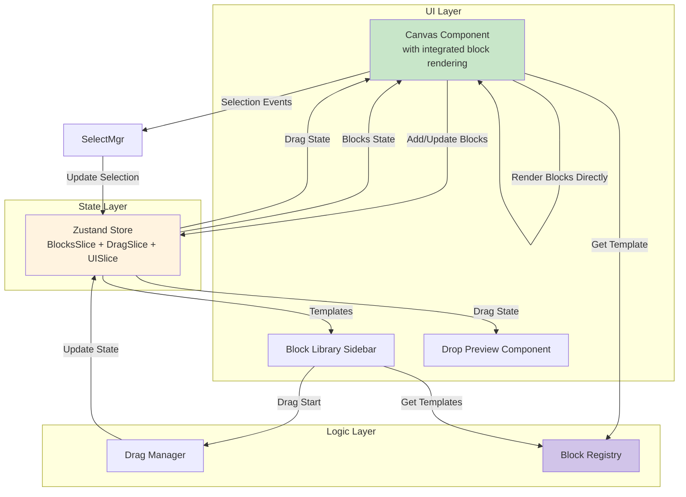

# Components

Based on the architectural patterns, tech stack, and data models, here are the major logical components across the fullstack application.

### Canvas Component

**Responsibility:** Manages the main workspace where blocks are positioned and rendered. Handles drop detection, position calculation, grid overlay, block rendering, and UI focus coordination.

**Key Interfaces:**

- `onMouseUp(e: MouseEvent)` - Detect drop events and calculate positions
- `onBlockMove(blockId: string, position: {x, y})` - Handle block repositioning
- `renderGrid()` - Display 40px grid overlay
- `onBlockClick(blockId: string)` - Handle block selection and trigger search blur
- `onBlockMouseDown(blockId: string)` - Handle drag initiation and trigger search blur

**Drop Handling Responsibilities:**

- Detect when mouse is released over canvas
- Calculate drop coordinates from mouse event
- Validate drop zone boundaries
- Create block instances via Block Registry
- Update block positions in store
- Call DragManager.endDrag() to clean up drag state

**Search Focus/Blur Integration:**

- **Block Selection → Blur Search**: When user selects or interacts with blocks, automatically triggers `blurSearchInput()` via UISlice
- Prevents typing conflicts between block interactions and search field
- Uses optional chaining (`blurSearchInput?.()`) for safe execution in test environments

**Dependencies:** Grid System Manager, Block Registry, Drag Manager, UISlice for focus management (no separate Block Renderer or Dead Zone components - Canvas renders blocks directly)

**Technology Stack:** React 19, Tailwind CSS for grid styling, Zustand for state

### Block Library Sidebar

**Responsibility:** Displays available block templates organized by category, enables drag initiation from template thumbnails, provides search functionality with UX focus management.

**Key Interfaces:**

- `getTemplatesByCategory(category: string)` - Filter templates
- `onDragStart(typeId: string)` - Initiate template drag
- `renderThumbnail(template: BlockTemplate)` - Display template preview
- `onSearchFocus()` - Clear canvas selection when search is focused
- `blurSearchInput()` - Remove focus from search input (triggered externally)

**Search Focus/Blur Interaction:**

- **Search Focus → Clear Selection**: When user focuses search input, canvas block selection is automatically cleared to prevent backspace conflicts
- **Block Selection → Blur Search**: When user selects a block on canvas, search input automatically loses focus via UISlice callback system
- Uses `registerSearchBlurCallback()` to establish communication bridge with Canvas component

**Dependencies:** Block Registry, Drag Manager, UISlice for focus management

**Technology Stack:** React 19, shadcn/ui ScrollArea and Input, Zustand for template and UI state

### Block Rendering (Integrated in Canvas)

**Responsibility:** Canvas component directly renders block instances using templates from the registry. No separate BlockRenderer or BlockInstance components exist.

**Implementation:**

- Canvas maps through blocks array and renders each block
- Template component retrieved from registry via `blockRegistry.getTemplate()`
- Block wrapped in absolutely positioned div with inline styles for position/size
- Component rendered with spread props from block.props

**Block Visual States:**

- Default: Gray border (border-gray-300)
- Selected: Blue border with ring (border-blue-500 ring-2 ring-blue-200)
- Hover: Light gray background (hover:bg-gray-50) - when not selected
- Hover + Selected: Slightly darker blue ring (hover:ring-blue-300)

**Dependencies:** Block Registry for templates, inline styles for positioning

**Technology Stack:** React 19 functional components, direct rendering without abstraction layers

### Drag Manager

**Responsibility:** Manages drag state and coordinates drag lifecycle. Follows separation of concerns principle where DragManager handles state management while Canvas handles drop detection and positioning.

**Key Interfaces:**

- `setDragState(state: Partial<DragState>)` - Update drag state with new values
- `updateDragPosition(x: number, y: number)` - Update current drag position
- `clearDragState()` - Reset all drag state to initial values

**State Properties:**

- `isActive: boolean` - Whether a drag operation is currently active
- `sourceType: 'library' | 'canvas' | null` - Origin of the dragged item
- `draggedItem: any` - The item being dragged (block template or existing block)
- `position: { x: number; y: number }` - Current drag position
- `offset: { x: number; y: number }` - Offset from drag start point

**Separation of Concerns:**

- **DragManager:** Manages drag state, notifies store of state changes
- **Canvas:** Detects drop events, calculates drop positions, validates drop zones, creates block instances

**Dependencies:** Grid System Manager for snapping, Canvas State for boundaries

**Technology Stack:** React 19 event handlers, Zustand for drag state

### Grid System Manager

**Responsibility:** Handles all grid-related calculations including snapping, grid rendering, and Alt-key bypass logic.

**Key Interfaces:**

- `snapToGrid(x: number, y: number, bypass: boolean)` - Calculate snapped position
- `getGridCells(x: number, y: number, width: number, height: number)` - Get occupied cells
- `renderGridOverlay()` - Generate grid visual
- `calculateDropPreview(x: number, y: number)` - Show drop zone

**Dependencies:** Canvas State for grid size configuration

**Technology Stack:** Pure TypeScript calculations, CSS for grid visualization

### Block Registry

**Responsibility:** Central repository for all available block templates, manages template lifecycle and instance creation.

**Key Interfaces:**

- `registerTemplate(template: BlockTemplate)` - Add new template
- `getTemplate(typeId: string)` - Retrieve specific template
- `generateBlockInstance(typeId: string, overrideProps?: any)` - Generate block instance with merged props (returns null if template not found)
- `getCategories()` - List all template categories
- `getAllTemplates()` - Returns all registered templates
- `getTemplatesByCategory(category: string)` - Filter templates by category

**Dependencies:** Local storage for caching (future)

**Technology Stack:** TypeScript Map for storage, Singleton pattern

### State Manager (Zustand Store)

**Responsibility:** Centralized state management using sliced architecture for blocks and drag operations.

**Store Structure:**

- `BlocksSlice`: Manages blocks array, block operations, and selection state
- `DragSlice`: Manages drag state and drag operations
- `UISlice`: Manages cross-component UI interactions (search focus/blur)
- Combined into single `AppStore` using Zustand's create function

**Key Interfaces:**

- **BlocksSlice:**

  - `addBlock(block: Block)` - Add new block to canvas
  - `updateBlock(id: string, updates: Partial<Block>)` - Modify block
  - `removeBlock(id: string)` - Remove block (not deleteBlock)
  - `clearBlocks()` - Remove all blocks
  - `getHighestZIndex()` - Get highest z-index for stacking
  - `selectBlock(blockId: string)` - Select single block (clears others)
  - `clearSelection()` - Clear all selections
  - Helper selectors: `getSelectedBlockIds`, `hasSelection`, `isBlockSelected`

- **DragSlice:**

  - `setDragState(state: Partial<DragState>)` - Update drag state
  - `updateDragPosition(x: number, y: number)` - Update current drag position
  - `clearDragState()` - Reset drag state
  - Helper selectors: `isDragging`, `getDraggedItem`, `getDragPosition`, `getDragOffset`, `getDragSource`

- **UISlice:**
  - `blurSearchInput()` - Trigger search input to lose focus
  - `registerSearchBlurCallback(callback)` - Register blur callback from BlockLibrary

**Dependencies:** None - top of state hierarchy

**Technology Stack:** Zustand 5.0+, TypeScript for type safety, sliced pattern for organization

### Selection Integration

**Current Implementation:** Selection is handled directly within Canvas component and BlocksSlice, without a separate manager component.

**Selection Flow:**

- Canvas component handles `onClick` events for blocks and empty canvas areas
- Block clicks call `selectBlock(blockId)` from BlocksSlice
- Canvas area clicks call `clearSelection()` from BlocksSlice
- BlocksSlice synchronizes both `selectedBlockIds` array and individual `block.selected` fields

**Current Keyboard Shortcuts:**

- `Delete/Backspace` - Delete selected blocks (via useKeyboard hook)
- `Click on block` - Single select (replaces current selection)
- `Click on canvas` - Clear all selection

**Future Multi-Selection Support:** Would require extending BlocksSlice with additional actions:

- `toggleBlockSelection(blockId)` for Ctrl/Cmd + Click
- `selectRange(fromBlockId, toBlockId)` for Shift + Click
- `selectAll()` for Ctrl/Cmd + A
- `selectWithinBounds(bounds)` for rectangle selection

**Dependencies:** BlocksSlice for state management, blocksSelectors for efficient queries

**Technology Stack:** Canvas component event handlers, BlocksSlice state management, useKeyboard hook

### Component Diagrams

