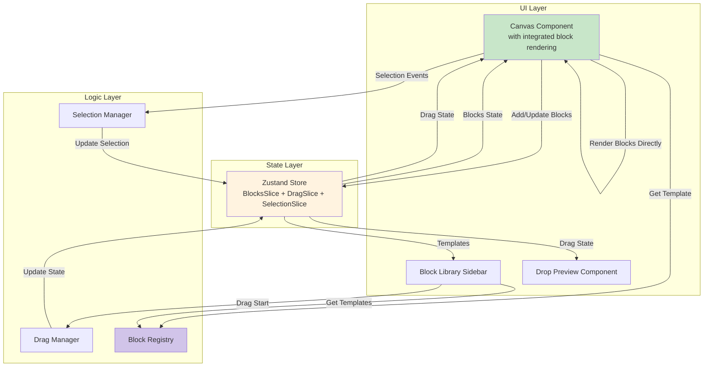

# Components

Based on the architectural patterns, tech stack, and data models, here are the major logical components across the fullstack application.

### Canvas Component

**Responsibility:** Manages the main workspace where blocks are positioned and rendered. Handles drop detection, position calculation, grid overlay, and block rendering.

**Key Interfaces:**
- `onMouseUp(e: MouseEvent)` - Detect drop events and calculate positions
- `onBlockMove(blockId: string, position: {x, y})` - Handle block repositioning
- `renderGrid()` - Display 60px grid overlay

**Drop Handling Responsibilities:**
- Detect when mouse is released over canvas
- Calculate drop coordinates from mouse event
- Validate drop zone boundaries
- Create block instances via Block Registry
- Update block positions in store
- Call DragManager.endDrag() to clean up drag state

**Dependencies:** Grid System Manager, Block Registry, Drag Manager (no separate Block Renderer or Dead Zone components - Canvas renders blocks directly)

**Technology Stack:** React 19, Tailwind CSS for grid styling, Zustand for state

### Block Library Sidebar

**Responsibility:** Displays available block templates organized by category, enables drag initiation from template thumbnails.

**Key Interfaces:**
- `getTemplatesByCategory(category: string)` - Filter templates
- `onDragStart(typeId: string)` - Initiate template drag
- `renderThumbnail(template: BlockTemplate)` - Display template preview

**Dependencies:** Block Registry, Drag Manager

**Technology Stack:** React 19, shadcn/ui ScrollArea, Zustand for template state

### Block Rendering (Integrated in Canvas)

**Responsibility:** Canvas component directly renders block instances using templates from the registry. No separate BlockRenderer or BlockInstance components exist.

**Implementation:**
- Canvas maps through blocks array and renders each block
- Template component retrieved from registry via `blockRegistry.getTemplate()`
- Block wrapped in absolutely positioned div with inline styles for position/size
- Component rendered with spread props from block.props

**Block Visual States:**
- Default: Gray border (border-gray-300)
- Selected: Blue border with ring (border-blue-500 ring-2 ring-blue-200)
- Hover: Light gray background (hover:bg-gray-50) - when not selected
- Hover + Selected: Slightly darker blue ring (hover:ring-blue-300)

**Dependencies:** Block Registry for templates, inline styles for positioning

**Technology Stack:** React 19 functional components, direct rendering without abstraction layers

### Drag Manager

**Responsibility:** Manages drag state and coordinates drag lifecycle. Follows separation of concerns principle where DragManager handles state management while Canvas handles drop detection and positioning.

**Key Interfaces:**
- `setDragState(state: Partial<DragState>)` - Update drag state with new values
- `updateDragPosition(x: number, y: number)` - Update current drag position
- `clearDragState()` - Reset all drag state to initial values

**State Properties:**
- `isActive: boolean` - Whether a drag operation is currently active
- `sourceType: 'library' | 'canvas' | null` - Origin of the dragged item
- `draggedItem: any` - The item being dragged (block template or existing block)
- `position: { x: number; y: number }` - Current drag position
- `offset: { x: number; y: number }` - Offset from drag start point

**Separation of Concerns:**
- **DragManager:** Manages drag state, handles Escape key cancellation, notifies store of state changes
- **Canvas:** Detects drop events, calculates drop positions, validates drop zones, creates block instances

**Dependencies:** Grid System Manager for snapping, Canvas State for boundaries

**Technology Stack:** React 19 event handlers, Zustand for drag state

### Grid System Manager

**Responsibility:** Handles all grid-related calculations including snapping, grid rendering, and Alt-key bypass logic.

**Key Interfaces:**
- `snapToGrid(x: number, y: number, bypass: boolean)` - Calculate snapped position
- `getGridCells(x: number, y: number, width: number, height: number)` - Get occupied cells
- `renderGridOverlay()` - Generate grid visual
- `calculateDropPreview(x: number, y: number)` - Show drop zone

**Dependencies:** Canvas State for grid size configuration

**Technology Stack:** Pure TypeScript calculations, CSS for grid visualization

### Block Registry

**Responsibility:** Central repository for all available block templates, manages template lifecycle and instance creation.

**Key Interfaces:**
- `registerTemplate(template: BlockTemplate)` - Add new template
- `getTemplate(typeId: string)` - Retrieve specific template
- `generateBlockInstance(typeId: string, overrideProps?: any)` - Generate block instance with merged props (returns null if template not found)
- `getCategories()` - List all template categories
- `getAllTemplates()` - Returns all registered templates
- `getTemplatesByCategory(category: string)` - Filter templates by category

**Dependencies:** Local storage for caching (future)

**Technology Stack:** TypeScript Map for storage, Singleton pattern

### State Manager (Zustand Store)

**Responsibility:** Centralized state management using sliced architecture for blocks and drag operations.

**Store Structure:**
- `BlocksSlice`: Manages blocks array and block operations
- `DragSlice`: Manages drag state and drag operations
- `SelectionSlice`: Manages multi-select state and selection operations
- Combined into single `AppStore` using Zustand's create function

**Key Interfaces:**
- **BlocksSlice:**
  - `addBlock(block: Block)` - Add new block to canvas
  - `updateBlock(id: string, updates: Partial<Block>)` - Modify block
  - `removeBlock(id: string)` - Remove block (not deleteBlock)
  - `clearBlocks()` - Remove all blocks
  - `getHighestZIndex()` - Get highest z-index for stacking

- **DragSlice:**
  - `setDragState(state: Partial<DragState>)` - Update drag state
  - `updateDragPosition(x: number, y: number)` - Update current drag position
  - `clearDragState()` - Reset drag state
  - Helper selectors: `isDragging`, `getDraggedItem`, `getDragPosition`, `getDragOffset`, `getDragSource`

- **SelectionSlice:**
  - `selectBlock(blockId, mode)` - Select block with mode ('replace', 'add', 'toggle')
  - `deselectBlock(blockId)` - Remove block from selection
  - `clearSelection()` - Clear all selections
  - `selectMultiple(blockIds)` - Select multiple blocks at once
  - `selectRange(fromBlockId, toBlockId)` - Select range of blocks (Shift+click)
  - `selectAll()` - Select all blocks in canvas
  - `selectWithinBounds(bounds)` - Select blocks within rectangle bounds

**Dependencies:** None - top of state hierarchy

**Technology Stack:** Zustand 5.0+, TypeScript for type safety, sliced pattern for organization

### Selection Manager

**Responsibility:** Handles selection-related user interactions and delegates to SelectionSlice for state updates.

**Key Interfaces:**
- `handleBlockClick(blockId: string, e: MouseEvent)` - Process click with keyboard modifiers
- `handleCanvasClick()` - Clear selection when clicking empty canvas
- `handleKeyboardShortcuts(e: KeyboardEvent)` - Process selection keyboard shortcuts
- `handleRectangleSelection(bounds: {x, y, width, height})` - Process drag-to-select

**Keyboard Shortcuts:**
- `Ctrl/Cmd + Click` - Toggle block selection
- `Shift + Click` - Select range of blocks
- `Ctrl/Cmd + A` - Select all blocks
- `Delete/Backspace` - Delete selected blocks
- `Escape` - Clear selection

**Dependencies:** SelectionSlice for state updates, uses selectionSelectors for efficient state queries

**Technology Stack:** React hooks for event handling, delegates state management to SelectionSlice

### Component Diagrams


