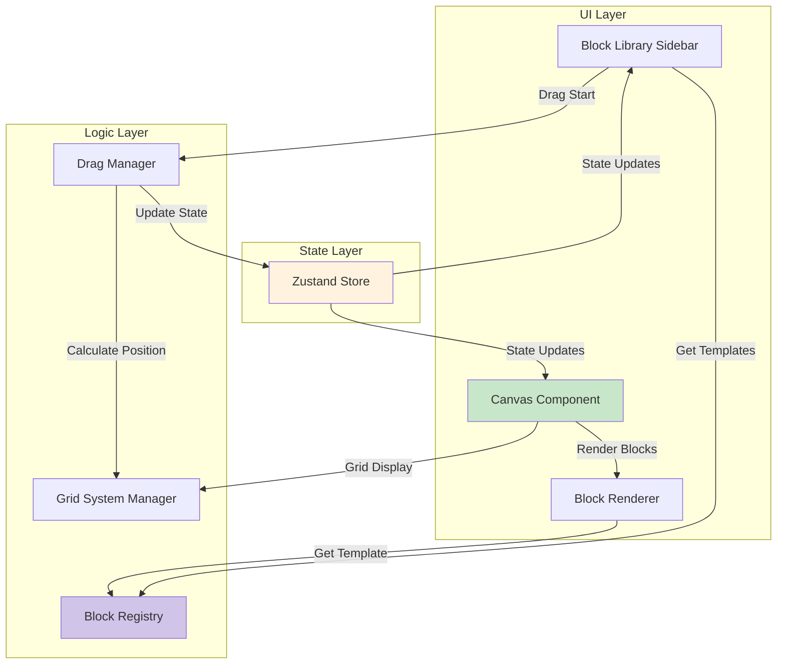

# Components

Based on the architectural patterns, tech stack, and data models, here are the major logical components across the fullstack application.

### Canvas Component

**Responsibility:** Manages the main workspace where blocks are positioned and rendered. Handles drop detection, position calculation, grid overlay, and block rendering.

**Key Interfaces:**
- `onMouseUp(e: MouseEvent)` - Detect drop events and calculate positions
- `onBlockMove(blockId: string, position: {x, y})` - Handle block repositioning
- `onBlockSelect(blockId: string)` - Handle block selection
- `renderGrid()` - Display 60px grid overlay

**Drop Handling Responsibilities:**
- Detect when mouse is released over canvas
- Calculate drop coordinates from mouse event
- Validate drop zone boundaries
- Create block instances via Block Registry
- Update block positions in store
- Call DragManager.endDrag() to clean up drag state

**Dependencies:** Grid System Manager, Block Renderer, Dead Zone Component, Block Registry, Drag Manager

**Technology Stack:** React 19, Tailwind CSS for grid styling, Zustand for state

### Block Library Sidebar

**Responsibility:** Displays available block templates organized by category, enables drag initiation from template thumbnails.

**Key Interfaces:**
- `getTemplatesByCategory(category: string)` - Filter templates
- `onDragStart(typeId: string)` - Initiate template drag
- `renderThumbnail(template: BlockTemplate)` - Display template preview

**Dependencies:** Block Registry, Drag Manager

**Technology Stack:** React 19, shadcn/ui ScrollArea, Zustand for template state

### Block Renderer

**Responsibility:** Dynamically renders block instances with their customized props, handles component code execution and styling.

**Key Interfaces:**
- `renderBlock(block: Block, template: BlockTemplate)` - Render single block
- `applyProps(component: React.ComponentType, props: any)` - Render component with props
- `handleSelection(blockId: string)` - Apply selection styling

**Dependencies:** Block Registry for templates, Global CSS for styling

**Technology Stack:** React 19 with dynamic component loading, React.lazy for code splitting

### Drag Manager

**Responsibility:** Manages drag state and coordinates drag lifecycle. Follows separation of concerns principle where DragManager handles state management while Canvas handles drop detection and positioning.

**Key Interfaces:**
- `startDrag(source: 'library' | 'canvas', item: any)` - Begin drag operation
- `updateDragPosition(x: number, y: number)` - Track mouse movement
- `endDrag()` - Complete drag operation (Canvas determines drop position)
- `cancelDrag()` - Cancel current drag

**Separation of Concerns:**
- **DragManager:** Manages drag state, handles Escape key cancellation, notifies store of state changes
- **Canvas:** Detects drop events, calculates drop positions, validates drop zones, creates block instances

**Dependencies:** Grid System Manager for snapping, Canvas State for boundaries

**Technology Stack:** React 19 event handlers, Zustand for drag state

### Grid System Manager

**Responsibility:** Handles all grid-related calculations including snapping, grid rendering, and Alt-key bypass logic.

**Key Interfaces:**
- `snapToGrid(x: number, y: number, bypass: boolean)` - Calculate snapped position
- `getGridCells(x: number, y: number, width: number, height: number)` - Get occupied cells
- `renderGridOverlay()` - Generate grid visual
- `calculateDropPreview(x: number, y: number)` - Show drop zone

**Dependencies:** Canvas State for grid size configuration

**Technology Stack:** Pure TypeScript calculations, CSS for grid visualization

### Block Registry

**Responsibility:** Central repository for all available block templates, manages template lifecycle and instance creation.

**Key Interfaces:**
- `registerTemplate(template: BlockTemplate)` - Add new template
- `getTemplate(typeId: string)` - Retrieve specific template
- `generateBlockInstance(typeId: string, overrideProps?: any)` - Generate block instance with merged props (returns null if template not found)
- `getCategories()` - List all template categories
- `getAllTemplates()` - Returns all registered templates
- `getTemplatesByCategory(category: string)` - Filter templates by category

**Dependencies:** Local storage for caching (future)

**Technology Stack:** TypeScript Map for storage, Singleton pattern

### State Manager (Zustand Store)

**Responsibility:** Centralized state management for canvas, blocks, drag operations, and UI state.

**Key Interfaces:**
- `addBlock(block: Block)` - Add new block to canvas
- `updateBlock(id: string, updates: Partial<Block>)` - Modify block
- `deleteBlock(id: string)` - Remove block
- `setDragState(state: DragState)` - Update drag operation

**Dependencies:** None - top of state hierarchy

**Technology Stack:** Zustand 4.5+, TypeScript for type safety

### Component Diagrams


