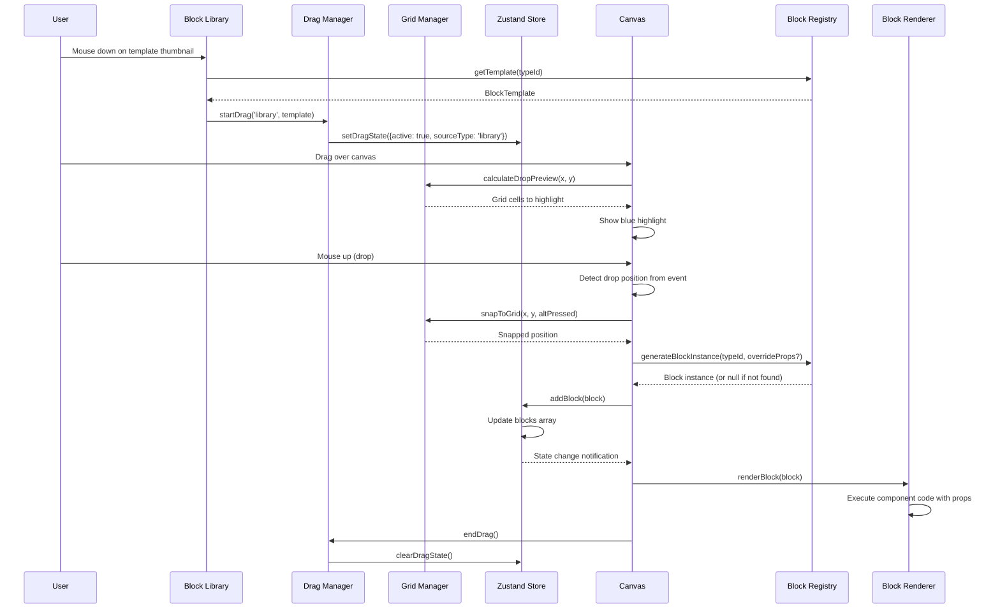
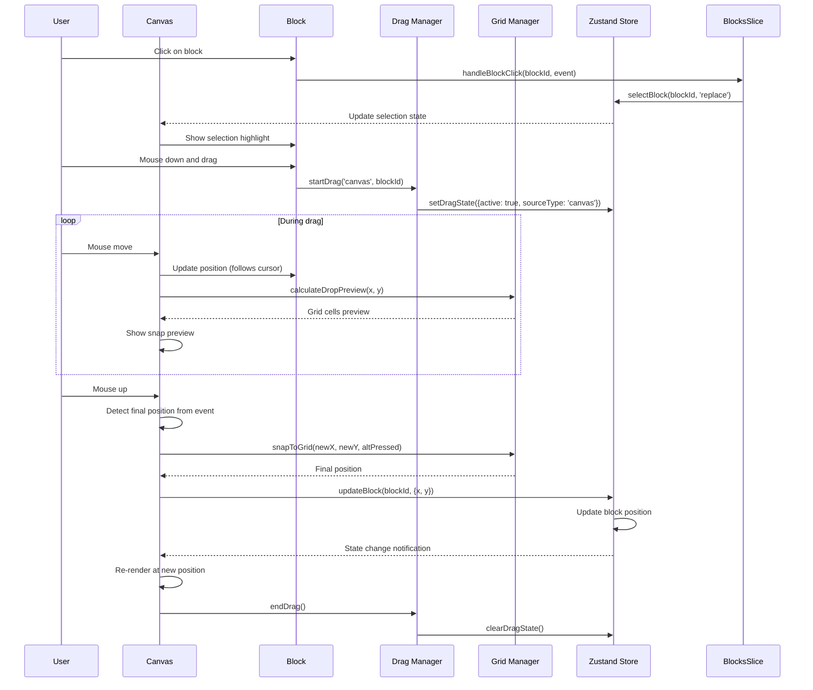
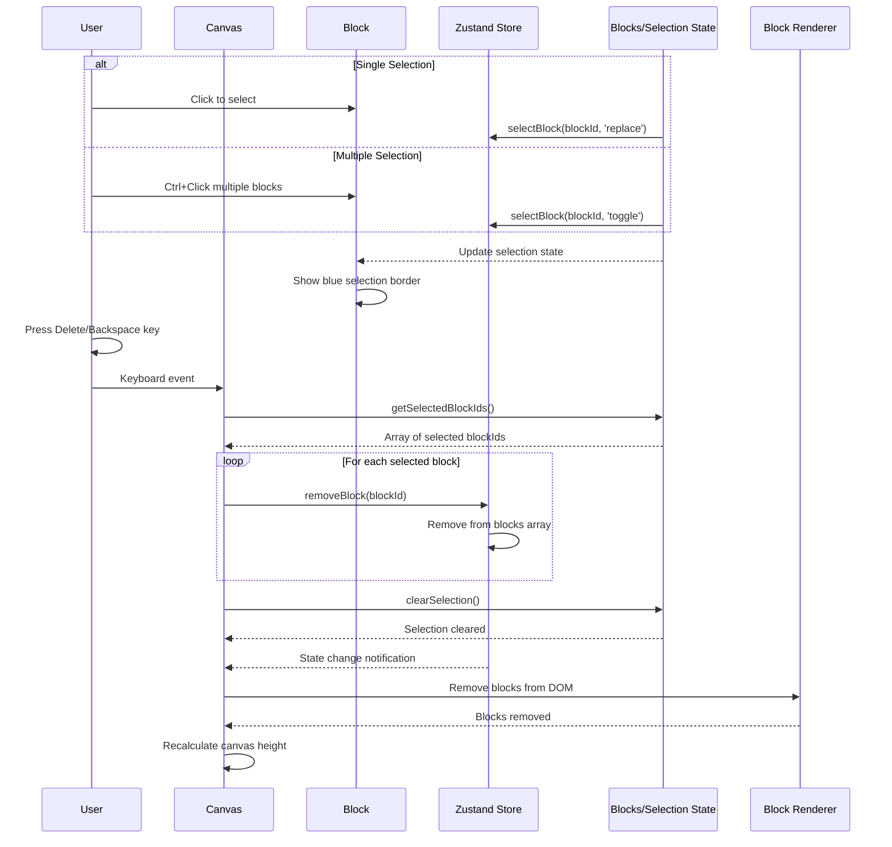
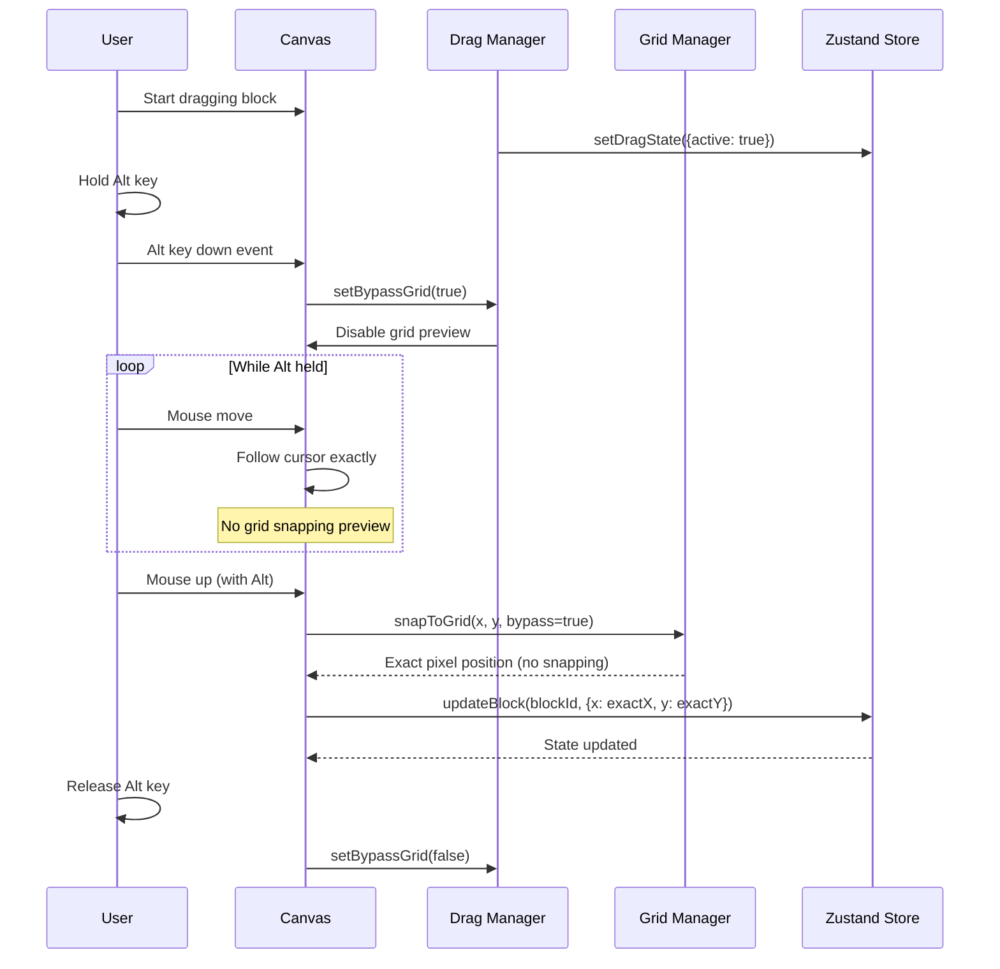
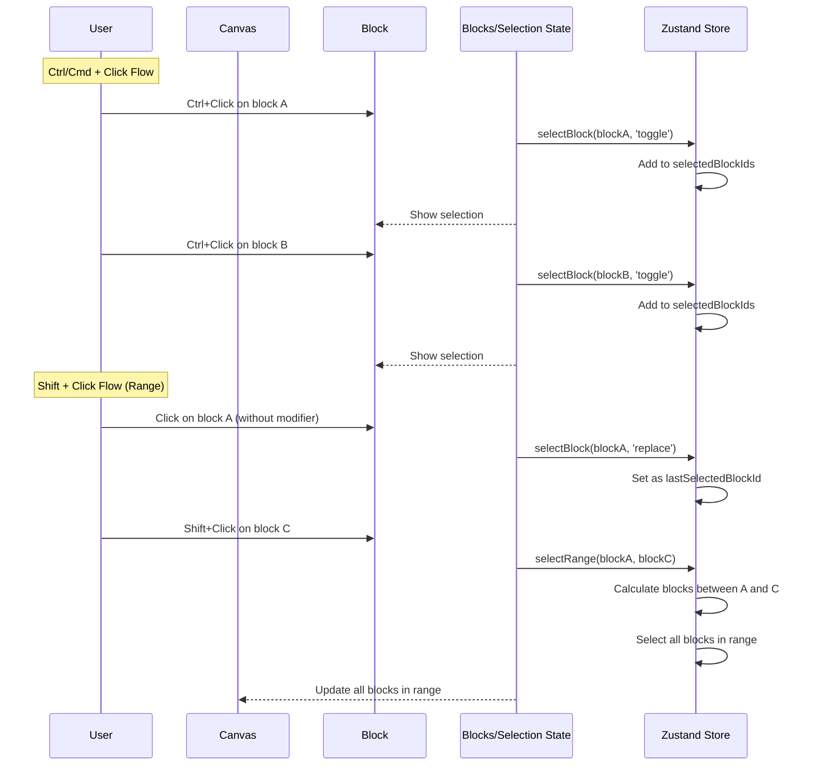
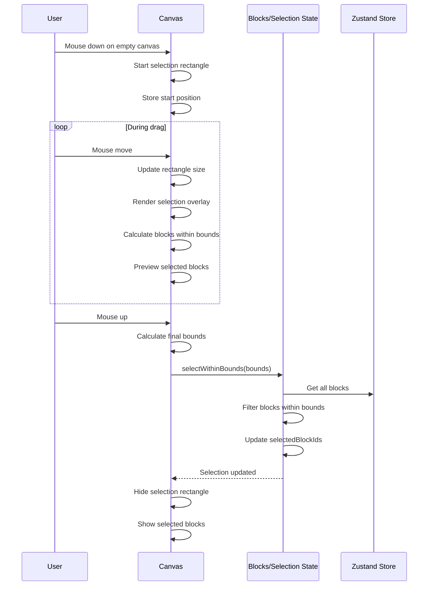
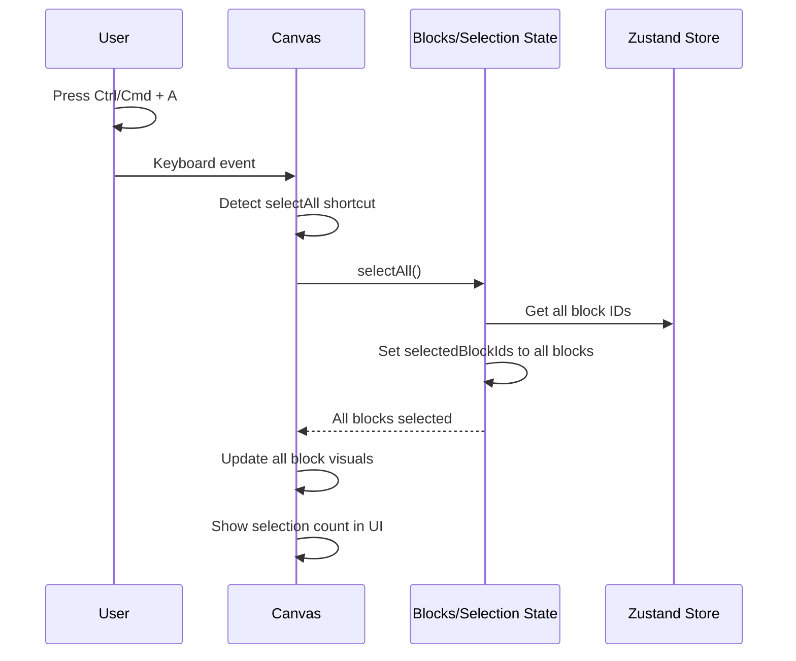
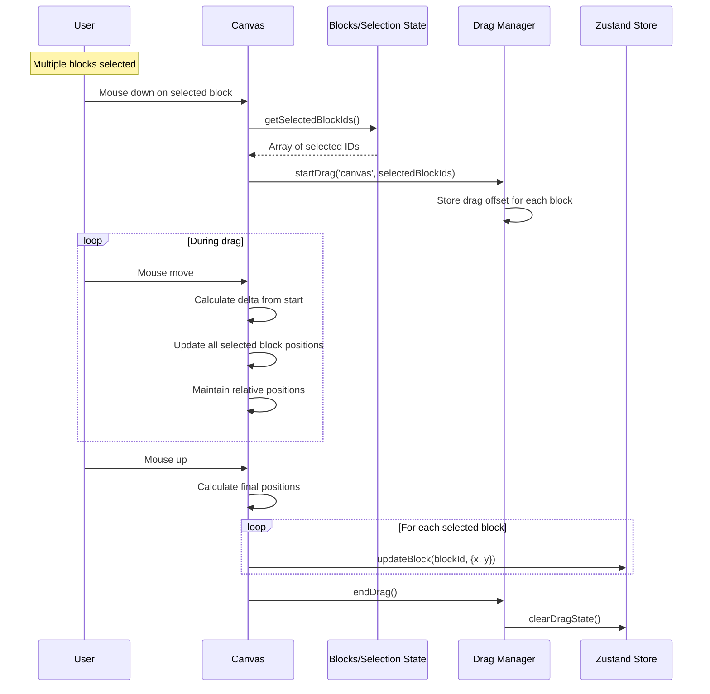
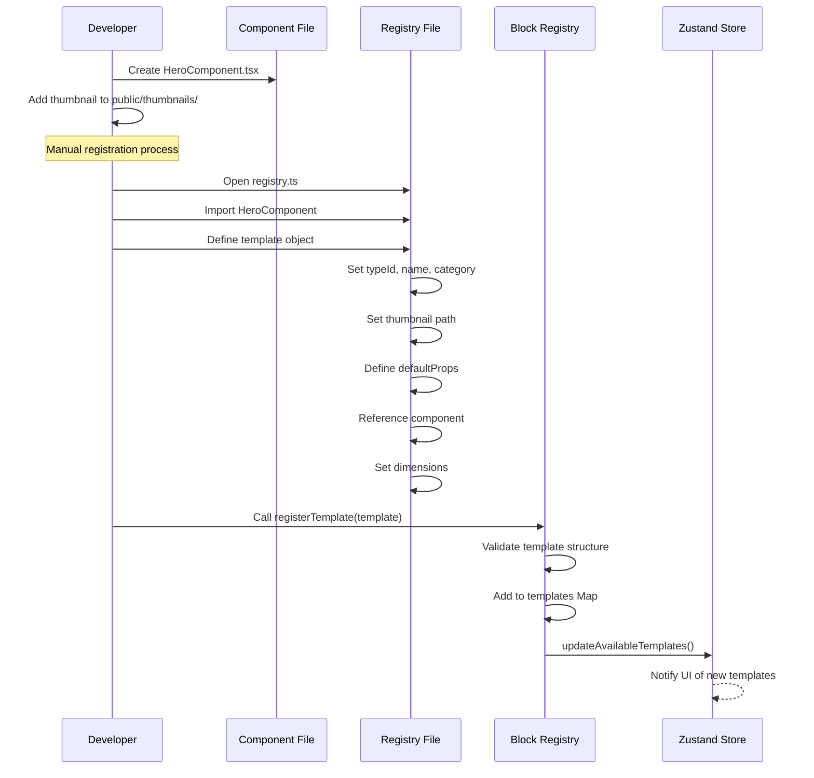

# Core Workflows

### Add Block from Library to Canvas

### Reposition Existing Block

### Delete Selected Blocks (Single or Multiple)

### Grid Bypass with Alt Key

### Multi-Select with Keyboard Modifiers

### Rectangle Selection (Drag to Select)

### Select All Blocks (Ctrl/Cmd + A)

### Bulk Move Operation

### Template Registration (Development Flow)

