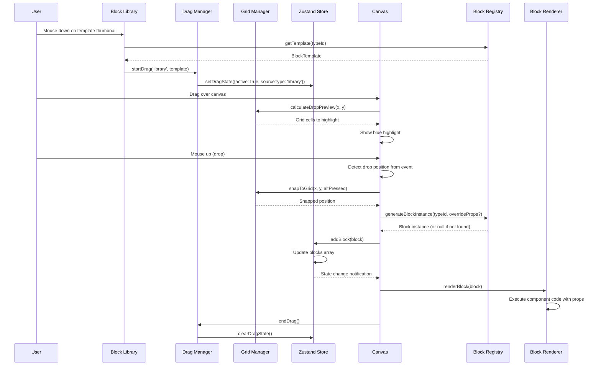
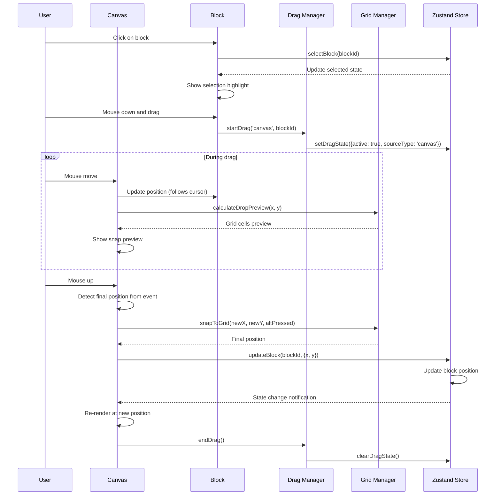
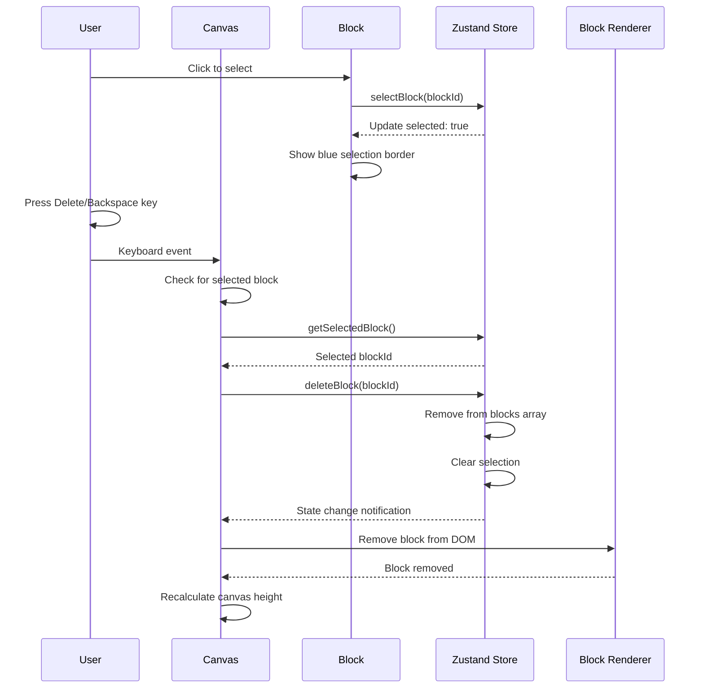
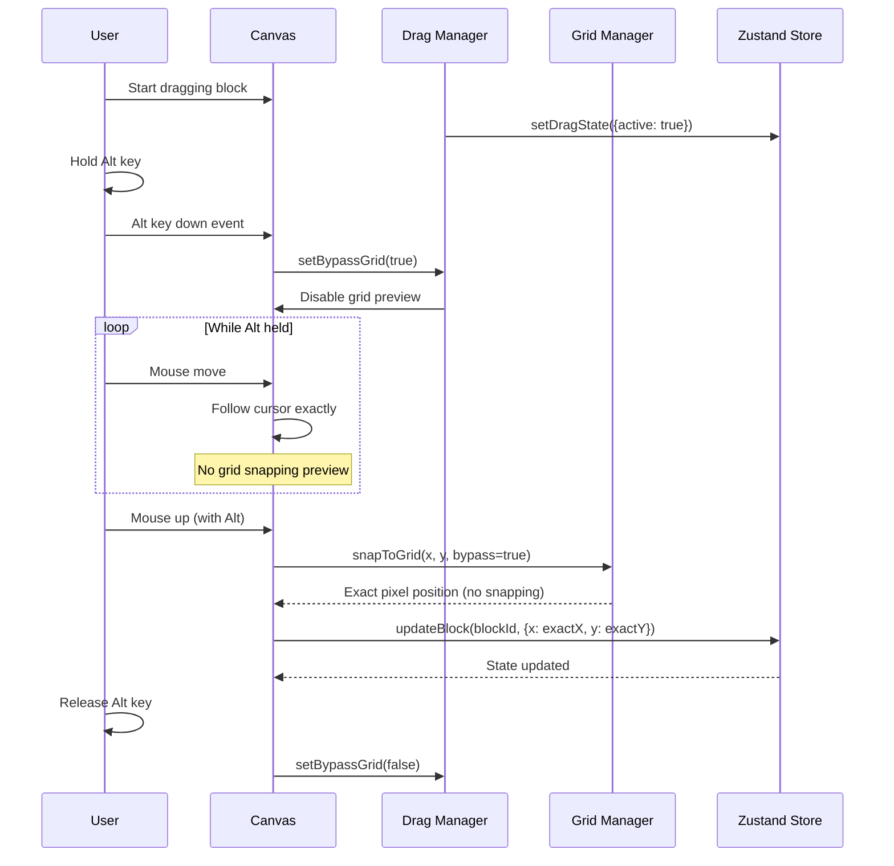
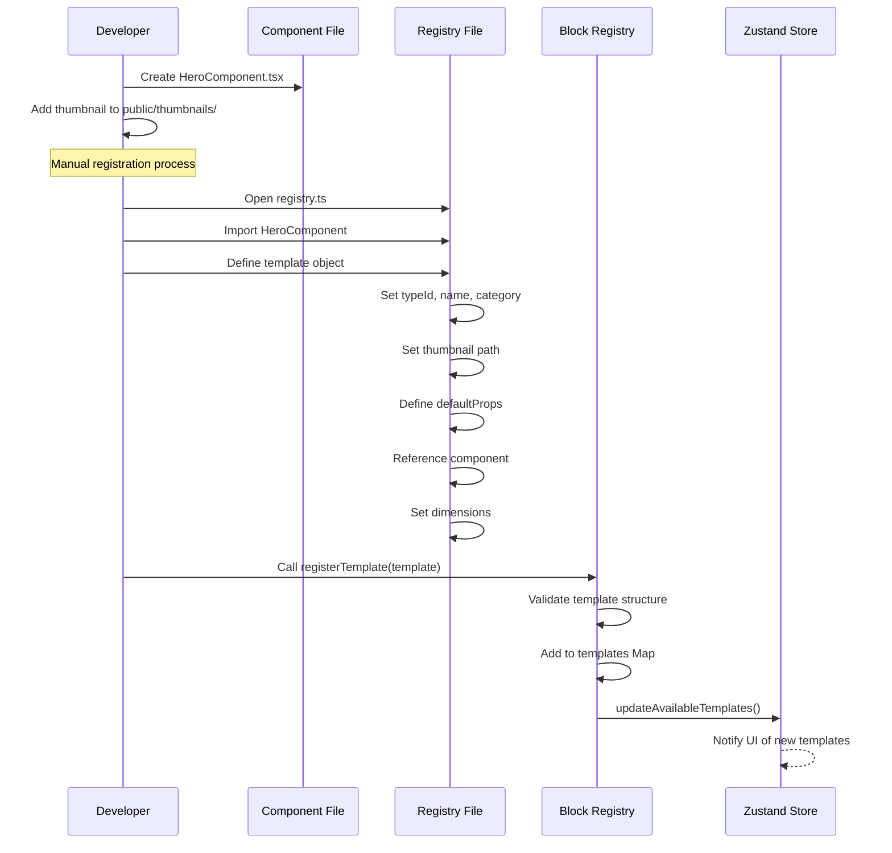

# Core Workflows

### Add Block from Library to Canvas

```mermaid
sequenceDiagram
    participant User
    participant Sidebar as Block Library
    participant DragMgr as Drag Manager
    participant GridMgr as Grid Manager
    participant Store as Zustand Store
    participant Canvas
    participant Registry as Block Registry
    participant Renderer as Block Renderer

    User->>Sidebar: Mouse down on template thumbnail
    Sidebar->>Registry: getTemplate(typeId)
    Registry-->>Sidebar: BlockTemplate
    Sidebar->>DragMgr: startDrag('library', template)
    DragMgr->>Store: setDragState({active: true, sourceType: 'library'})
    
    User->>Canvas: Drag over canvas
    Canvas->>GridMgr: calculateDropPreview(x, y)
    GridMgr-->>Canvas: Grid cells to highlight
    Canvas->>Canvas: Show blue highlight
    
    User->>Canvas: Mouse up (drop)
    Canvas->>Canvas: Detect drop position from event
    Canvas->>GridMgr: snapToGrid(x, y, altPressed)
    GridMgr-->>Canvas: Snapped position
    Canvas->>Registry: generateBlockInstance(typeId, overrideProps?)
    Registry-->>Canvas: Block instance (or null if not found)
    Canvas->>Store: addBlock(block)
    Store->>Store: Update blocks array
    Store-->>Canvas: State change notification
    Canvas->>Renderer: renderBlock(block)
    Renderer->>Renderer: Execute component code with props
    Canvas->>DragMgr: endDrag()
    DragMgr->>Store: clearDragState()
```

### Reposition Existing Block

```mermaid
sequenceDiagram
    participant User
    participant Canvas
    participant Block
    participant DragMgr as Drag Manager
    participant GridMgr as Grid Manager
    participant Store as Zustand Store

    User->>Block: Click on block
    Block->>Store: selectBlock(blockId)
    Store-->>Block: Update selected state
    Block->>Block: Show selection highlight
    
    User->>Block: Mouse down and drag
    Block->>DragMgr: startDrag('canvas', blockId)
    DragMgr->>Store: setDragState({active: true, sourceType: 'canvas'})
    
    loop During drag
        User->>Canvas: Mouse move
        Canvas->>Block: Update position (follows cursor)
        Canvas->>GridMgr: calculateDropPreview(x, y)
        GridMgr-->>Canvas: Grid cells preview
        Canvas->>Canvas: Show snap preview
    end
    
    User->>Canvas: Mouse up
    Canvas->>Canvas: Detect final position from event
    Canvas->>GridMgr: snapToGrid(newX, newY, altPressed)
    GridMgr-->>Canvas: Final position
    Canvas->>Store: updateBlock(blockId, {x, y})
    Store->>Store: Update block position
    Store-->>Canvas: State change notification
    Canvas->>Canvas: Re-render at new position
    Canvas->>DragMgr: endDrag()
    DragMgr->>Store: clearDragState()
```

### Delete Selected Block

```mermaid
sequenceDiagram
    participant User
    participant Canvas
    participant Block
    participant Store as Zustand Store
    participant Renderer as Block Renderer

    User->>Block: Click to select
    Block->>Store: selectBlock(blockId)
    Store-->>Block: Update selected: true
    Block->>Block: Show blue selection border
    
    User->>User: Press Delete/Backspace key
    User->>Canvas: Keyboard event
    Canvas->>Canvas: Check for selected block
    Canvas->>Store: getSelectedBlock()
    Store-->>Canvas: Selected blockId
    
    Canvas->>Store: deleteBlock(blockId)
    Store->>Store: Remove from blocks array
    Store->>Store: Clear selection
    Store-->>Canvas: State change notification
    Canvas->>Renderer: Remove block from DOM
    Renderer-->>Canvas: Block removed
    Canvas->>Canvas: Recalculate canvas height
```

### Grid Bypass with Alt Key

```mermaid
sequenceDiagram
    participant User
    participant Canvas
    participant DragMgr as Drag Manager
    participant GridMgr as Grid Manager
    participant Store as Zustand Store

    User->>Canvas: Start dragging block
    DragMgr->>Store: setDragState({active: true})
    
    User->>User: Hold Alt key
    User->>Canvas: Alt key down event
    Canvas->>DragMgr: setBypassGrid(true)
    DragMgr->>Canvas: Disable grid preview
    
    loop While Alt held
        User->>Canvas: Mouse move
        Canvas->>Canvas: Follow cursor exactly
        Note over Canvas: No grid snapping preview
    end
    
    User->>Canvas: Mouse up (with Alt)
    Canvas->>GridMgr: snapToGrid(x, y, bypass=true)
    GridMgr-->>Canvas: Exact pixel position (no snapping)
    Canvas->>Store: updateBlock(blockId, {x: exactX, y: exactY})
    Store-->>Canvas: State updated
    
    User->>User: Release Alt key
    Canvas->>DragMgr: setBypassGrid(false)
```

### Template Registration (Development Flow)

```mermaid
sequenceDiagram
    participant Dev as Developer
    participant Comp as Component File
    participant Reg as Registry File
    participant Registry as Block Registry
    participant Store as Zustand Store

    Dev->>Comp: Create HeroComponent.tsx
    Dev->>Dev: Add thumbnail to public/thumbnails/
    
    Note over Dev: Manual registration process
    
    Dev->>Reg: Open registry.ts
    Dev->>Reg: Import HeroComponent
    Dev->>Reg: Define template object
    Reg->>Reg: Set typeId, name, category
    Reg->>Reg: Set thumbnail path
    Reg->>Reg: Define defaultProps
    Reg->>Reg: Reference component
    Reg->>Reg: Set dimensions
    
    Dev->>Registry: Call registerTemplate(template)
    Registry->>Registry: Validate template structure
    Registry->>Registry: Add to templates Map
    Registry->>Store: updateAvailableTemplates()
    Store-->>Store: Notify UI of new templates
```

