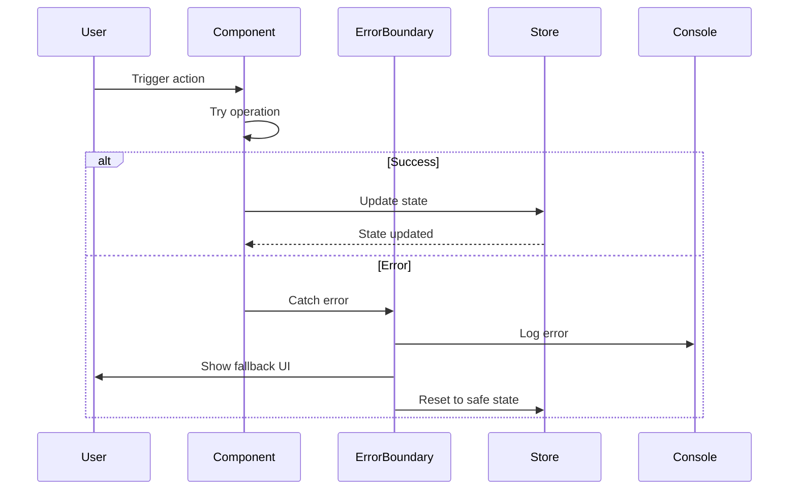

# Error Handling Strategy

## Error Flow



## Error Response Format

```typescript
interface AppError {
  code: string;
  message: string;
  details?: Record<string, any>;
  timestamp: string;
  recoverable: boolean;
}
```

## Frontend Error Handling

```typescript
// Error boundary for components
class BlockErrorBoundary extends Component<Props, State> {
  componentDidCatch(error: Error, errorInfo: ErrorInfo) {
    console.error('Block rendering error:', error, errorInfo);
    
    // Reset block to safe state
    this.props.resetBlock(this.props.blockId);
  }
  
  render() {
    if (this.state.hasError) {
      return (
        <div className="error-placeholder">
          Failed to render block
        </div>
      );
    }
    
    return this.props.children;
  }
}
```

## Backend Error Handling

```typescript
// N/A - No backend for MVP
```
