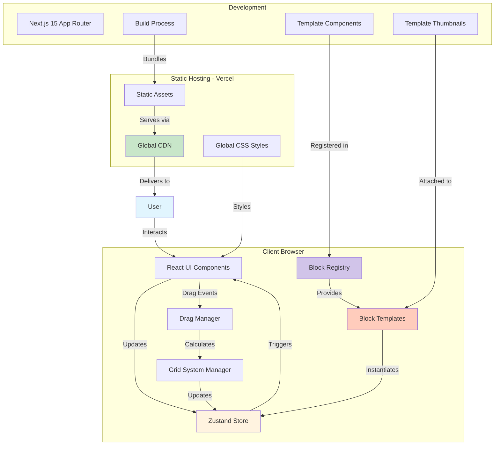

# High Level Architecture

### Technical Summary

DraftCN is a client-side visual website builder utilizing Next.js 15's App Router with React 19 for optimal performance. The architecture employs a grid-based drag-and-drop system with freeform block positioning, managed through Zustand for predictable state management. The frontend leverages shadcn/ui components for consistent UI elements, while the 60px grid system ensures professional layouts. With no backend services, the application runs entirely in the browser, deploying as a static site to Vercel for global edge distribution. This architecture achieves the PRD goals by providing immediate visual feedback, intuitive grid-based placement, and a foundation for future enhancements while maintaining 60fps performance during drag operations.

### Platform and Infrastructure Choice

**Platform:** Vercel  
**Key Services:** Edge Network, Static Site Hosting, Analytics (optional)  
**Deployment Host and Regions:** Global Edge Network (automatic)

### Repository Structure

**Structure:** Monorepo  
**Monorepo Tool:** npm workspaces (built-in, simple for single app)  
**Package Organization:** Single Next.js app with potential for shared packages in future

### High Level Architecture Diagram

### Architectural Patterns

- **Component-Based Architecture:** Modular React components with shadcn/ui for reusability - *Rationale:* Enables rapid UI development and consistent design system
- **Template-Instance Pattern:** Separation of block templates (definitions) from block instances (positioned elements) - *Rationale:* Allows reuse of templates with different content/props
- **Client-Side State Management:** Zustand store for all application state including blocks and templates - *Rationale:* Lightweight, performant, and simple compared to Redux
- **Grid-First Positioning:** 60px grid system as primary layout constraint - *Rationale:* Provides predictable, professional layouts while simplifying position calculations
- **Props-Based Customization:** Block content customized via props without modifying template code - *Rationale:* Enables future inline editing without template changes
- **Static Site Generation:** Pre-rendered HTML with client-side hydration - *Rationale:* Fastest initial load times
- **Template Registry Pattern:** Centralized management of available block templates - *Rationale:* Simplifies template discovery and instantiation
- **Event-Driven Updates:** Mouse/keyboard events trigger state changes - *Rationale:* Direct manipulation requires immediate event handling
- **Render Optimization:** React.memo and selective re-renders - *Rationale:* Maintains 60fps during rapid drag operations

