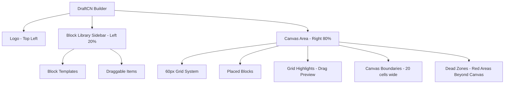
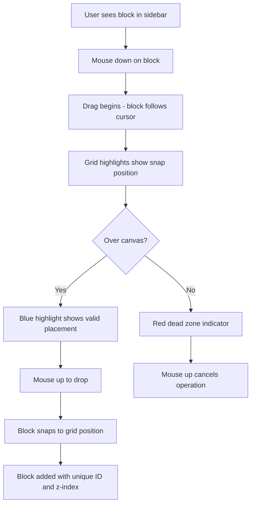
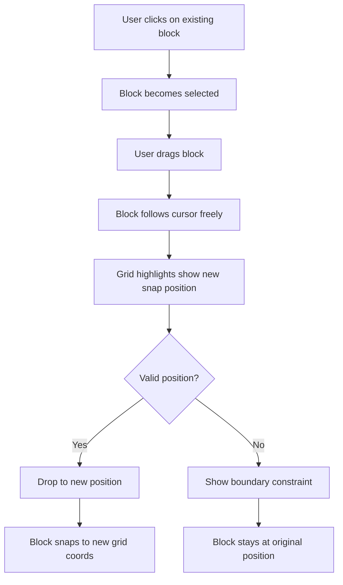
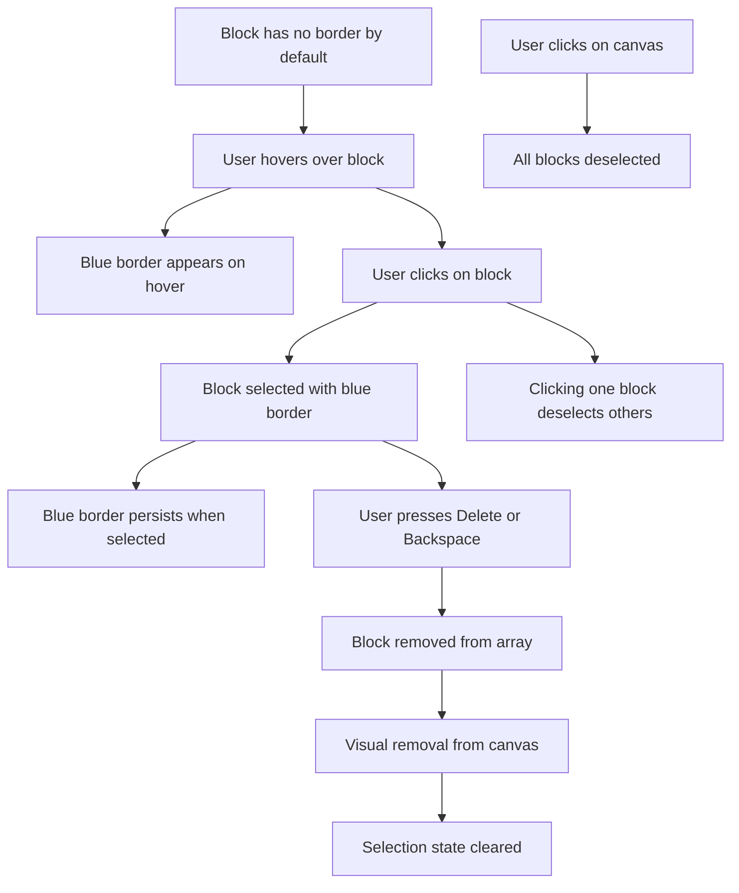
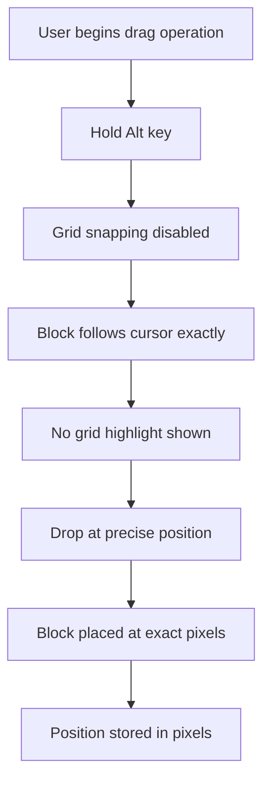

# DraftCN UI/UX Specification

## Introduction

This document defines the user experience goals, information architecture, user flows, and visual design specifications for DraftCN's user interface. It serves as the foundation for visual design and frontend development, ensuring a cohesive and user-centered experience.

## Overall UX Goals & Principles

### Target User Personas

-   **Website Builder:** Non-technical users who need to quickly create web pages using drag-and-drop without coding
-   **Designer:** Visual designers who want to prototype layouts using pre-built components and a grid system
-   **Content Creator:** Users who need to assemble web pages from existing blocks without dealing with code

### Usability Goals

-   **Immediate Understanding:** Users can start dragging and dropping blocks within seconds - no tutorial needed
-   **Visual Clarity:** Grid system and visual guides make placement intuitive and predictable
-   **Error Prevention:** Dead zones and boundary enforcement prevent invalid placements
-   **Direct Manipulation:** What you see is what you get - blocks move freely during drag with clear snap preview
-   **Minimal Cognitive Load:** No complex menus or modes - just drag blocks from sidebar to canvas

### Design Principles

1. **Visual-first approach** - Grid lines, highlights, and dead zones provide continuous visual guidance
2. **Direct manipulation** - Drag and drop with immediate visual feedback, no abstract concepts
3. **Constraint-based freedom** - Freeform placement within clear boundaries (20-cell grid width)
4. **Progressive complexity** - Start simple (drag & drop), add complexity later (Alt key for pixel precision)
5. **Zero persistence anxiety** - No save buttons or data loss warnings - intentionally ephemeral for experimentation

## Change Log

| Date       | Version | Description                 | Author            |
| ---------- | ------- | --------------------------- | ----------------- |
| 2025-09-06 | 1.0     | Initial UI/UX Specification | Sally (UX Expert) |

## Information Architecture (IA)

### Site Map / Screen Inventory

### Navigation Structure

**Primary Navigation:** Not applicable - tool operates as a single workspace

**Secondary Navigation:** Vertical scrolling within block library for accessing all templates

**Breadcrumb Strategy:** Not needed - no hierarchical pages or sections to navigate

## User Flows

### Flow: Add Block to Canvas

**User Goal:** Place a new block from the library onto the canvas

**Entry Points:** Mouse down on any block template in the left sidebar

**Success Criteria:** Block is placed on canvas at grid-snapped position and appears in the blocks array

#### Flow Diagram

#### Edge Cases & Error Handling:

-   Dropping in dead zones (beyond 20-cell width) cancels the operation
-   Blocks can overlap - z-index determines stacking order
-   Canvas auto-expands downward if block placed near bottom

**Notes:** Grid highlights update in real-time during drag to show exact placement position

### Flow: Reposition Existing Block

**User Goal:** Move an already-placed block to a new position on the canvas

**Entry Points:** Click and drag on any block already on the canvas

**Success Criteria:** Block moves to new grid position while maintaining its z-index

#### Flow Diagram

#### Edge Cases & Error Handling:

-   Blocks cannot be moved beyond canvas boundaries (0 to 20 cells wide)
-   Movement respects block dimensions - entire block must stay within bounds
-   Alt key allows pixel-precise positioning without grid snap

**Notes:** Movement is constrained to keep entire block within canvas area

### Flow: Select and Delete Block

**User Goal:** Remove an unwanted block from the canvas

**Entry Points:** Click on any block to select, then press Delete/Backspace key

**Success Criteria:** Selected block is removed from canvas and blocks array

#### Flow Diagram

#### Edge Cases & Error Handling:

-   Blocks have no visible border by default
-   Only one block can be selected at a time
-   Clicking on one block automatically deselects all other blocks
-   Click on canvas deselects all blocks
-   Hovering shows blue border (same style as selected)
-   Blue border persists when block is selected
-   Deleting non-existent selection does nothing
-   No confirmation dialog - deletion is immediate (no persistence means low risk)

**Notes:** Selection visual feedback is critical for user confidence with hover and selection states using the same blue border style

### Flow: Grid Bypass with Alt Key

**User Goal:** Position a block with pixel precision instead of grid snapping

**Entry Points:** Hold Alt key while dragging any block (new or existing)

**Success Criteria:** Block is placed at exact pixel position without snapping to 60px grid

#### Flow Diagram

#### Edge Cases & Error Handling:

-   Releasing Alt key during drag re-enables grid snapping
-   Pixel-precise blocks still respect canvas boundaries
-   Blocks placed with Alt can later be moved with grid snapping

**Notes:** Alt bypass is for advanced users who need precise control

## Wireframes & Mockups

### Design Files

**Primary Design Files:** To be created in Figma/design tool of choice for high-fidelity mockups

### Key Screen Layouts

#### Main Builder Interface

**Purpose:** The single-screen workspace where all building activities occur

**Key Elements:**

-   Logo positioned in top-left corner for brand presence
-   Block library sidebar (20% width) with scrollable template list
-   Canvas area (80% width) with visible 60px grid overlay
-   Visual dead zones appearing as red semi-transparent areas when zoomed out

**Interaction Notes:** All interactions happen through direct manipulation - drag from sidebar to canvas, click to select, drag to reposition

**Design File Reference:** [Link to main builder frame in design tool]

#### Block Library Sidebar

**Purpose:** Display all available block templates for dragging onto canvas

**Key Elements:**

-   Fixed width at 20% of viewport
-   Vertical scroll for accessing all templates
-   Block thumbnails with consistent sizing
-   Visual grouping by block category (Hero, Navbar, Footer, etc.)

**Interaction Notes:** Hover states on blocks show draggable cursor, mousedown initiates drag operation

**Design File Reference:** [Link to sidebar component in design tool]

#### Canvas with Grid System

**Purpose:** Main workspace for block placement and arrangement

**Key Elements:**

-   60px grid lines visible as subtle gray guides
-   20 cells wide (1200px reference width)
-   Dynamic height based on content plus buffer
-   Grid highlight overlay during drag operations

**Interaction Notes:** Grid highlights show blue for valid placement, red for invalid areas, blocks snap on drop unless Alt key held

**Design File Reference:** [Link to canvas states in design tool]

#### Block States

**Purpose:** Visual feedback for different block interaction states

**Key Elements:**

-   Default state: Block rendered with no border or additional styling
-   Hover state: Blue border to indicate interactivity (same style as selected)
-   Selected state: Blue border that persists when block is selected
-   Dragging state: Reduced opacity with cursor following

**Interaction Notes:** States provide clear feedback for user actions, selected blocks respond to keyboard commands

**Design File Reference:** [Link to block state variations in design tool]

## Component Library / Design System

### Design System Approach

**Design System Approach:** Leverage shadcn/ui components as the foundation, with custom builder-specific components layered on top. No need to reinvent the wheel - use existing, well-tested patterns.

### Core Components

#### Grid Overlay

**Purpose:** Provide visual guidance for block placement with 60px grid lines

**Variants:** Single variant - always visible gray grid lines

**States:** Static display - no interactive states

**Usage Guidelines:** Rendered as CSS background pattern on canvas, uses subtle gray (#e5e5e5) to avoid visual interference with content

#### Block Container

**Purpose:** Wrapper component for all draggable blocks on the canvas

**Variants:** Different block types (Hero, Navbar, Footer) but same container behavior

**States:** Default, Hover, Selected, Dragging

**Usage Guidelines:** All blocks must be wrapped in this container to ensure consistent positioning, selection, and drag behavior

#### Library Item

**Purpose:** Display block templates in the sidebar for dragging

**Variants:** Visual variations based on block category but same interaction model

**States:** Default, Hover, Dragging

**Usage Guidelines:** Each item shows thumbnail preview, maintains consistent height for vertical rhythm, includes drag initialization data attributes

#### Canvas Container

**Purpose:** Main workspace area with boundary enforcement and auto-expansion

**Variants:** Single variant with dynamic height calculation

**States:** Default, Receiving (during drag), Expanded (when content grows)

**Usage Guidelines:** Maintains 80% width, calculates height based on lowest block position plus 20-cell buffer, minimum height equals viewport

#### Dead Zone Indicator

**Purpose:** Visual boundary markers showing invalid drop areas

**Variants:** Left, Right, and Bottom dead zones

**States:** Hidden (default), Visible (when zoomed out or during drag)

**Usage Guidelines:** Semi-transparent red (#cc0000, 20% opacity) overlays, only appear when contextually relevant

#### Drag Preview

**Purpose:** Visual feedback during drag operations

**Variants:** Ghost image following cursor, Grid highlight showing snap position

**States:** Following (cursor tracking), Snapping (grid alignment preview)

**Usage Guidelines:** Ghost at 50% opacity for visibility, highlight uses blue for valid placement, red for invalid

## Branding & Style Guide

### Visual Identity

**Brand Guidelines:** Minimal, functional aesthetic aligned with developer tools - clean, unobtrusive, focus on content over chrome

### Color Palette

| Color Type | Hex Code                           | Usage                                             |
| ---------- | ---------------------------------- | ------------------------------------------------- |
| Primary    | #000000                            | Selection borders, primary text                   |
| Secondary  | #666666                            | Sidebar borders, secondary elements               |
| Accent     | #333333                            | Active states, emphasis                           |
| Success    | #22c55e                            | Future: successful operations, confirmations      |
| Warning    | #f59e0b                            | Future: caution states, important notices         |
| Error      | #cc0000                            | Dead zones, invalid placements                    |
| Neutral    | #e5e5e5, #f5f5f5, #999999, #cccccc | Grid lines, backgrounds, borders, disabled states |

### Typography

#### Font Families

-   **Primary:** System UI font stack (fast loading, no external dependencies)
-   **Secondary:** Not applicable - single font family
-   **Monospace:** System mono for any code display

#### Type Scale

| Element | Size | Weight | Line Height |
| ------- | ---- | ------ | ----------- |
| H1      | 24px | 600    | 1.2         |
| H2      | 20px | 600    | 1.3         |
| H3      | 16px | 600    | 1.4         |
| Body    | 14px | 400    | 1.5         |
| Small   | 12px | 400    | 1.5         |

### Iconography

**Icon Library:** Minimal icon usage - drag cursors and basic UI indicators only

**Usage Guidelines:** Use system cursors for drag operations, avoid decorative icons to maintain focus on blocks

### Spacing & Layout

**Grid System:** 60px base grid for all block positioning, 20 cells wide (1200px reference)

**Spacing Scale:** 4px, 8px, 12px, 16px, 24px, 32px for UI element spacing (not block placement)

## Accessibility Requirements

### Compliance Target

**Standard:** WCAG 2.1 Level AA compliance for drag-and-drop interfaces

### Key Requirements

**Visual:**

-   Color contrast ratios: Minimum 4.5:1 for normal text, 3:1 for large text and UI components
-   Focus indicators: Visible keyboard focus with 2px black border for all interactive elements
-   Text sizing: Minimum 14px for body text, user-scalable interface

**Interaction:**

-   Keyboard navigation: Full keyboard support for all operations (arrow keys for movement, space/enter for selection)
-   Screen reader support: ARIA labels for blocks, live regions for state changes
-   Touch targets: Minimum 44x44px touch targets for mobile future compatibility

**Content:**

-   Alternative text: Descriptive labels for all block thumbnails in library
-   Heading structure: Logical heading hierarchy (though minimal in MVP)
-   Form labels: Not applicable in MVP (no forms)

### Testing Strategy

Testing Strategy: Manual testing with keyboard navigation, color contrast analyzers for monochrome palette validation, screen reader testing for block selection and movement announcements

## Responsiveness Strategy

### Breakpoints

| Breakpoint | Min Width | Max Width | Target Devices                                                    |
| ---------- | --------- | --------- | ----------------------------------------------------------------- |
| Desktop    | 1200px    | -         | All devices with 1200px+ width (desktops, laptops, large tablets) |

### Adaptation Patterns

**Layout Changes:** Fixed layout with 20% sidebar and 80% canvas - no breakpoint adaptations needed

**Navigation Changes:** Not applicable - single screen interface remains consistent

**Content Priority:** All elements always visible - sidebar and canvas maintain their proportions

**Interaction Changes:** Mouse-based drag-and-drop with keyboard shortcuts (Alt key for grid bypass)

## Animation & Micro-interactions

### Motion Principles

Instant feedback with minimal animation - prioritize responsiveness over smooth transitions. Animations should be functional, not decorative, providing clear cause-and-effect relationships.

### Key Animations

-   **Block Hover:** Subtle shadow appears (Duration: 0ms, Easing: none - instant)
-   **Selection State:** Border appears immediately (Duration: 0ms, Easing: none - instant)
-   **Drag Ghost:** 50% opacity applied instantly (Duration: 0ms, Easing: none - instant)
-   **Grid Highlight:** Instant appearance during drag (Duration: 0ms, Easing: none - instant)
-   **Block Snap:** Instant snap to grid on drop (Duration: 0ms, Easing: none - instant)

## Performance Considerations

### Performance Goals

-   **Page Load:** Under 1 second for initial builder interface
-   **Interaction Response:** Instant (< 16ms) for all user actions
-   **Animation FPS:** Not applicable - no animations

### Design Strategies

Minimize DOM manipulation during drag operations, use CSS transforms for positioning blocks, implement virtual scrolling for large block libraries (future), cache block thumbnails, avoid complex gradients or shadows

## Checklist Results

All UI/UX specification requirements have been addressed. The document provides comprehensive design direction for the DraftCN builder MVP, with clear constraints (1200px+ only, no persistence, desktop-focused) and specific implementation guidance aligned with the technical specification.
